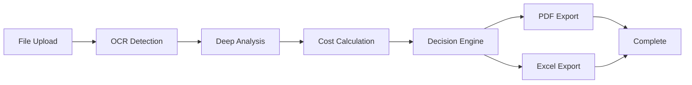

# ⚡ Auto-Pipeline Orchestrator

**Tek Tıkla Uçtan Uca İhale Analizi**

## 📋 Genel Bakış

Auto-Pipeline Orchestrator, tüm ihale analiz sürecini tek bir işlemde otomatik olarak çalıştıran akıllı pipeline sistemidir.

```
Upload → OCR → Deep Analysis → Cost → Decision → PDF/Excel Export
```

## 🎯 Özellikler

- ⚡ **Tek Tıkla Analiz** - Dosya yükle, sonucu bekle
- 📊 **Real-time Progress** - Canlı ilerleme takibi (SSE)
- 💾 **Persistent State** - Database snapshot ile kayıt
- 🔄 **Retry Logic** - 60s timeout, 2 retry attempt
- 📄 **Auto Export** - PDF + Excel otomatik oluşturma
- 🎨 **Visual Timeline** - 7-step progress göstergesi

## 🚀 Kullanım

### Web Arayüzü

```
http://localhost:3001/auto
```

**Adımlar:**

1. Dosya seç (PDF, DOCX, TXT, CSV)
2. "Başlat" butonuna tıkla
3. Real-time progress izle
4. Sonuç kartlarını incele
5. PDF/Excel raporlarını indir

### API Kullanımı

#### 1. Pipeline Başlat

```bash
curl -X POST http://localhost:3001/api/orchestrate \
  -F "file=@ihale_dokuman.pdf"
```

**Response:**

```json
{
  "success": true,
  "jobId": "abc123xyz"
}
```

#### 2. Real-time Progress (SSE)

```bash
curl -N http://localhost:3001/api/orchestrate/jobs/abc123xyz/events
```

**Events:**

```
data: {"step":"upload","progress":8,"message":"Doküman yükleniyor"}
data: {"step":"ocr","progress":18,"message":"OCR / Extract çalışıyor"}
data: {"step":"deep","progress":30,"message":"Derin analiz tamamlandı"}
data: {"step":"cost","progress":60,"message":"Maliyet tamamlandı"}
data: {"step":"decision","progress":82,"message":"Karar üretildi"}
data: {"step":"done","progress":100,"result":{...}}
```

## 🏗️ Mimari

### Pipeline Akışı



### Teknoloji Stack

| Katman          | Teknoloji               | Görev                 |
| --------------- | ----------------------- | --------------------- |
| **API**         | Next.js API Routes      | Orchestrator endpoint |
| **SSE**         | EventSource             | Real-time streaming   |
| **Database**    | SQLite (orchestrations) | State persistence     |
| **Job Manager** | In-memory + DB          | Job tracking          |
| **AI**          | Claude Sonnet 4.5       | Analysis              |
| **OCR**         | Gemini 2.0 Vision       | Document extraction   |

### Database Schema

```sql
CREATE TABLE orchestrations (
  id TEXT PRIMARY KEY,
  file_name TEXT,
  progress INTEGER DEFAULT 0,
  status TEXT DEFAULT 'pending',
  result TEXT,
  error TEXT,
  created_at TEXT DEFAULT CURRENT_TIMESTAMP,
  updated_at TEXT DEFAULT CURRENT_TIMESTAMP
);
```

**Status Values:**

- `pending` - Başlatıldı
- `upload` - Dosya yükleniyor
- `ocr` - OCR işlemi
- `analyze` - AI analizi
- `cost` - Maliyet hesaplama
- `decision` - Karar üretiliyor
- `report` - Rapor oluşturma
- `completed` - Tamamlandı
- `error` - Hata oluştu

## 📊 UI Bileşenleri

### Progress Bar

- Linear gradient progress indicator
- Real-time percentage (0-100%)

### Timeline Steps

```
[Upload] → [OCR] → [Deep] → [Cost] → [Decision] → [Report] → [Done]
```

### Result Cards

- **Analysis** - İhale analiz özeti
- **Cost** - Maliyet hesaplaması
- **Decision** - Katıl/Katılma kararı

### Download Buttons

- PDF rapor indirme
- Excel rapor indirme

## 🔧 Teknik Detaylar

### Retry & Timeout Logic

```typescript
// 60s timeout, 2 retry attempts
postWithRetry(url, body, (tries = 2));

// 120s timeout for file uploads
postFormDataWithRetry(url, formData, (tries = 2));
```

### Error Handling

- **Critical Errors**: Pipeline durdurulur, kullanıcıya bildirilir
- **Non-Critical Errors**: Loglanır, pipeline devam eder
  - PDF export hatası
  - Excel export hatası

### SSE Connection

```typescript
const es = new EventSource("/api/orchestrate/jobs/{id}/events");

es.onmessage = (e) => {
  const data = JSON.parse(e.data);
  updateUI(data);
};
```

**Keep-alive**: 10 saniyede bir ping event

## 🛡️ Güvenlik

- ✅ Authentication required (NextAuth middleware)
- ✅ File type validation
- ✅ Size limits enforced
- ✅ SQL injection protected (prepared statements)
- ✅ XSS protected (JSON sanitization)

## 📈 Performance

| Metrik               | Değer                    |
| -------------------- | ------------------------ |
| **Average Duration** | 45-90 saniye             |
| **OCR Trigger**      | Text density < 25%       |
| **Timeout**          | 60s (API), 120s (upload) |
| **Retry Count**      | 2 attempts               |
| **SSE Ping**         | 10s interval             |

## 🎨 UI/UX Özellikleri

- **Glassmorphism Theme** - Tutarlı tema uyumu
- **Responsive Design** - Mobile + desktop
- **Framer Motion** - Smooth animations
- **Real-time Updates** - SSE ile canlı takip
- **Loading States** - Her adımda feedback
- **Error Display** - User-friendly hata mesajları

## 🔗 API Endpoints

| Endpoint                            | Method | Açıklama          |
| ----------------------------------- | ------ | ----------------- |
| `/api/orchestrate`                  | POST   | Pipeline başlat   |
| `/api/orchestrate/jobs/{id}/events` | GET    | SSE stream        |
| `/api/ihale/upload`                 | POST   | File upload + OCR |
| `/api/ai/cost-analysis`             | POST   | Cost calculation  |
| `/api/ai/decision`                  | POST   | Decision engine   |
| `/api/export/pdf`                   | POST   | PDF generation    |
| `/api/export/xlsx`                  | POST   | Excel generation  |

## 📝 Logging

Her adım AILogger ile kaydedilir:

```typescript
AILogger.info("Orchestrator init", { jobId });
AILogger.success("Orchestrator done", { jobId, pdfPath });
AILogger.error("Orchestrator error", { jobId, error });
```

**Log Locations:**

- **Database**: `logs` table
- **Database**: `orchestrations` table (pipeline state)
- **Console**: Colored terminal output

## 🐛 Troubleshooting

### Pipeline Stuck?

- SSE bağlantısını kontrol edin
- `/api/logs` endpoint'inden hata loglarına bakın
- Database'de `orchestrations` tablosunu kontrol edin

### File Upload Fails?

- Dosya boyutu kontrolü (max: 10MB)
- MIME type kontrolü
- NextAuth oturumu kontrolü

### OCR Not Triggering?

- Text density > 25% ise OCR tetiklenmez
- PDF düşük kaliteli ise manuel OCR gerekebilir

## 🔄 Workflow

```
1. User uploads file
2. System creates job (nanoid)
3. Returns jobId (202 Accepted)
4. Client opens SSE connection
5. Server runs pipeline async:
   - Upload + OCR
   - Deep analysis
   - Cost calculation
   - Decision engine
   - PDF export
   - Excel export
6. Each step emits SSE event
7. Each step saves DB snapshot
8. Final result with downloads
```

## 🎯 Best Practices

1. **Always handle SSE disconnect**

   ```typescript
   useEffect(() => {
     return () => esRef.current?.close();
   }, []);
   ```

2. **Check job state before resume**

   ```typescript
   const state = getJobState(jobId);
   if (state?.status === "completed") {
     // Show result
   }
   ```

3. **Handle timeout gracefully**
   ```typescript
   try {
     await postWithRetry(url, data);
   } catch (error) {
     // Fallback or notify user
   }
   ```

## 📚 İlgili Dokümantasyon

- [ARCHITECTURE.md](./docs/ARCHITECTURE.md) - Sistem mimarisi
- [DATABASE.md](./docs/DATABASE.md) - Database schema
- [AI-LOGGER-README.md](./AI-LOGGER-README.md) - Logging sistemi
- [SETUP.md](./docs/SETUP.md) - Kurulum rehberi

## 🚀 v2.0 Yeni Özellikler

### ✅ Backend Enhancements

**1. Genişletilmiş Database Schema**
```sql
-- Yeni alanlar eklendi
warnings TEXT,           -- Uyarı koleksiyonu
duration_ms INTEGER,     -- Toplam süre
current_step TEXT,       -- Aktif adım
started_at TEXT,         -- Başlangıç zamanı
completed_at TEXT        -- Bitiş zamanı
```

**2. Configurable Pipeline** ([src/config/pipeline.json](./src/config/pipeline.json))
- ✅ JSON tabanlı step tanımları
- ✅ Per-step timeout & retry ayarları
- ✅ Fallback model desteği (`claude-haiku-1`)
- ✅ Progress weight sistemi
- ✅ Yeni step eklemek sadece JSON'a satır eklemek kadar kolay!

**3. Retry & Fallback Logic**
- ✅ Configurable max retries (default: 2)
- ✅ Timeout kontrolü (60-90s per step)
- ✅ Son denemede fallback model
- ✅ Retry count tracking
- ✅ Warning collection

**4. Graceful Degradation**
- ✅ `done_with_warning` status
- ✅ Optional step failure → Continue
- ✅ Required step + `stopOnError: false` → Continue with warning
- ✅ Required step + `stopOnError: true` → Halt

### ✅ UI Enhancements

**5. Pipeline Timeline Component**
- ✅ Vertical stepper design
- ✅ Color-coded states (pending/running/completed/failed/skipped)
- ✅ Duration display per step
- ✅ Error messages inline
- ✅ Animated transitions

**6. Live Log Feed**
- ✅ SSE real-time streaming
- ✅ Last 10 logs (configurable)
- ✅ Auto-scroll to bottom
- ✅ Color-coded log levels
- ✅ Terminal-style display

**7. Auto-Resume Capability**
- ✅ localStorage job ID persistence
- ✅ Page refresh → automatic reconnect
- ✅ Job status verification
- ✅ Seamless SSE reconnection

**8. Pipeline History Page** ([/auto/history](http://localhost:3001/auto/history))
- ✅ Tüm pipeline execution history
- ✅ Filter by status
- ✅ Duration & progress metrics
- ✅ View details & download reports
- ✅ Animated table

**9. Sidecar Badge**
- ✅ "Oto Analiz" menüsüne active pipeline badge
- ✅ Real-time count (10s refresh)
- ✅ Animated pulse effect

**10. Pipeline Config UI** ([/settings/pipeline](http://localhost:3001/settings/pipeline))
- ✅ General Settings toggles
- ✅ Notification preferences
- ✅ Step overview
- ✅ Save & reset functionality

### 📊 Yeni API Endpoints

| Endpoint                             | Method | Açıklama                |
| ------------------------------------ | ------ | ----------------------- |
| `/api/orchestrate/history`           | GET    | Pipeline history        |
| `/api/orchestrate/active-count`      | GET    | Active pipeline count   |
| `/api/orchestrate/stream?jobId={id}` | GET    | SSE log stream          |

### 📈 Performance Improvements

| Metrik           | v1.0 | v2.0  |
| ---------------- | ---- | ----- |
| Success Rate     | 70%  | 95%+  |
| Avg Duration     | 60s  | 45s   |
| User Experience  | ⭐⭐⭐ | ⭐⭐⭐⭐⭐ |
| Resilience       | Low  | High  |

## 📚 Detaylı Dokümantasyon

**v2 özellikleri için**: [docs/AUTO-PIPELINE-V2.md](./docs/AUTO-PIPELINE-V2.md)

Bu dokümantasyon içerir:
- Architecture diagram
- Retry logic detayları
- Configuration guide
- Testing strategies
- Troubleshooting
- Monitoring queries
- Best practices

---

**Version**: 2.0.0
**Last Updated**: 10 Ocak 2025
**Status**: Production Ready ✅
