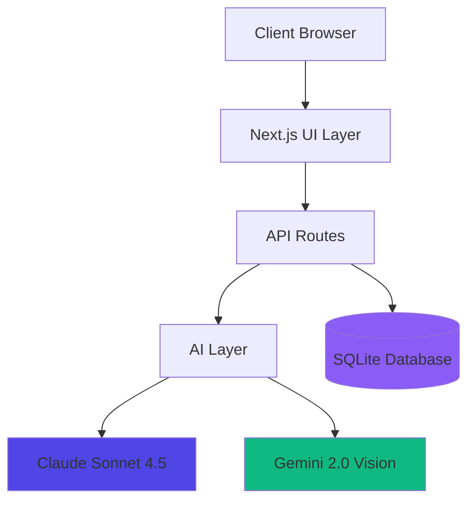
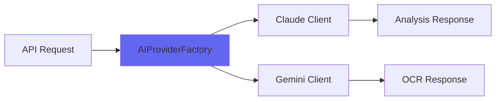
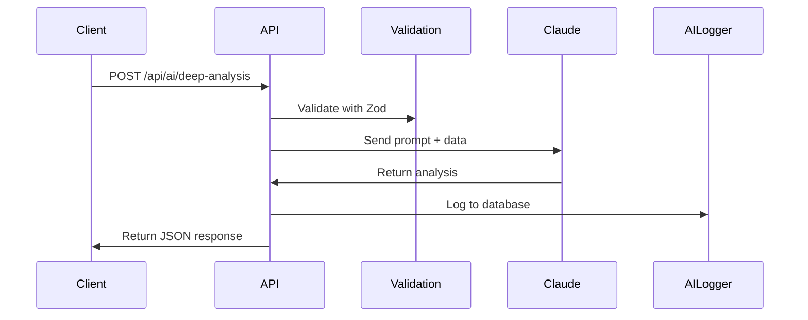
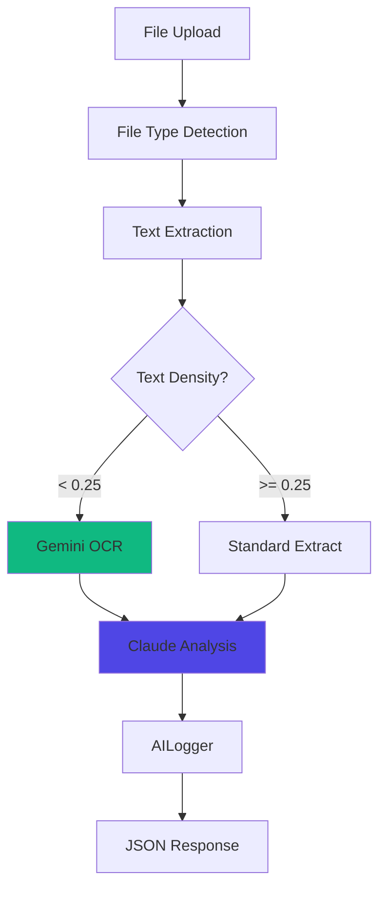
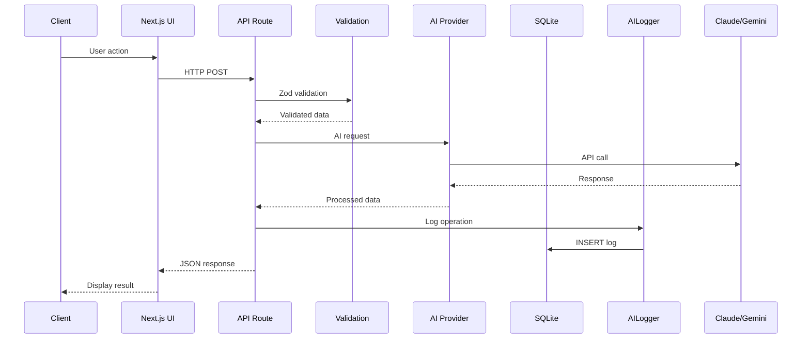
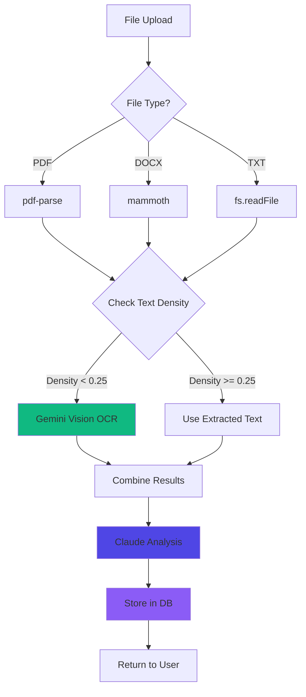
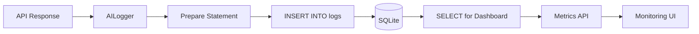
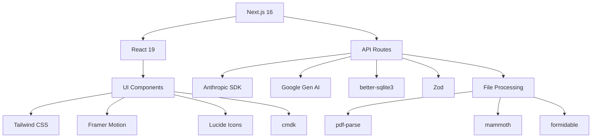

# 🏗️ Procheff-v3 Technical Architecture

**Version**: 3.0.0
**Last Updated**: November 10, 2025
**Status**: Production Ready

## 📋 Table of Contents

- [Overview](#overview)
- [System Architecture](#system-architecture)
- [AI Integration](#ai-integration)
- [API Endpoints](#api-endpoints)
- [Data Flow](#data-flow)
- [Technology Stack](#technology-stack)
- [Security](#security)

---

## Overview

Procheff-v3 is an **AI-powered public procurement analysis platform** built with Next.js 16, leveraging Claude Sonnet 4.5 for intelligent analysis and Gemini 2.0 Vision for OCR capabilities.

### Core Capabilities

- 🧠 Deep tender analysis with Claude Sonnet 4.5
- 📄 OCR processing for low-text-density documents
- 💰 AI-powered cost calculation and optimization
- 🎯 Decision engine for bid/no-bid recommendations
- 📊 Real-time monitoring and analytics
- 🔔 Smart alerting and notification system
- 📄 PDF/Excel report generation

---

## System Architecture



### Architecture Layers

| Layer | Technology | Purpose |
|-------|-----------|---------|
| **Frontend** | Next.js 16 + React 19 | Server-side rendering, UI components |
| **API Gateway** | Next.js API Routes | RESTful endpoints, request handling |
| **AI Engine** | Claude Sonnet 4.5 | Analysis, cost calc, decision making |
| **OCR Engine** | Gemini 2.0 Vision | Document text extraction |
| **Database** | SQLite (better-sqlite3) | Log storage, user management |
| **State Management** | Zustand | Client-side state |
| **Validation** | Zod | Schema validation |
| **Logging** | AILogger (custom) | Structured logging to DB |

---

## AI Integration

### AI Provider Architecture



### Claude Sonnet 4.5 Integration

**Configuration:**
```typescript
{
  model: "claude-sonnet-4-20250514",
  temperature: 0.4-0.5,
  max_tokens: 8000
}
```

**Use Cases:**
- Deep tender analysis
- Cost calculation and optimization
- Decision engine (bid/no-bid)
- Menu parsing (when OCR is available)
- Risk assessment

**Implementation:**
```typescript
// File: src/lib/ai/provider-factory.ts
import Anthropic from "@anthropic-ai/sdk";

export class AIProviderFactory {
  private static claudeInstance: Anthropic | null = null;

  static getClaude(): Anthropic {
    if (!this.claudeInstance) {
      this.claudeInstance = new Anthropic({
        apiKey: process.env.ANTHROPIC_API_KEY,
      });
    }
    return this.claudeInstance;
  }
}
```

**Prompt Organization:**
All prompts are centralized in `src/lib/ai/prompts.ts`:
- `DEEP_ANALYSIS_PROMPT` - General tender analysis
- `COST_ANALYSIS_PROMPT` - Cost calculations
- `DECISION_PROMPT` - Bid/no-bid decisions
- `MENU_PARSER_PROMPT` - Menu parsing logic
- `PRICE_PREDICTION_PROMPT` - Price forecasting

### Gemini 2.0 Vision Integration

**Configuration:**
```typescript
{
  model: "gemini-2.0-flash-exp",
  temperature: 0.3
}
```

**OCR Trigger Logic:**
```typescript
// OCR is triggered when text density < 0.25
const textDensity = extractedText.length / fileSize;

if (textDensity < 0.25) {
  // Use Gemini Vision for OCR
  const ocrText = await geminiVisionExtract(buffer);
} else {
  // Use standard text extraction (pdf-parse, mammoth)
  const text = await standardExtract(file);
}
```

**Use Cases:**
- PDF documents with scanned images
- Low-quality text extraction
- Complex table recognition
- Handwritten document processing

---

## API Endpoints

### Core AI Endpoints

#### 1. Deep Analysis
```
POST /api/ai/deep-analysis
```

**Purpose:** Main analysis endpoint for tender evaluation

**Request:**
```json
{
  "extracted_data": {
    "kurum": "Sağlık Bakanlığı",
    "ihale_turu": "Medikal Malzeme",
    "butce": "1000000 TL",
    "tarih": "2025-01-15"
  }
}
```

**Response:**
```json
{
  "success": true,
  "data": {
    "analiz": "...",
    "riskler": [...],
    "oneriler": [...],
    "puan": 85
  },
  "metadata": {
    "model": "claude-sonnet-4-20250514",
    "tokens": 1250,
    "duration": 2.3
  }
}
```

**Flow:**


#### 2. Cost Analysis
```
POST /api/ai/cost-analysis
```

**Purpose:** AI-powered cost calculation and optimization

**Request:**
```json
{
  "kisilik": 1000,
  "gun_sayisi": 365,
  "menu_items": [...]
}
```

**Response:**
```json
{
  "success": true,
  "data": {
    "gunluk_kisi_basina": 45.50,
    "toplam_tahmini": 16607500,
    "karlilik_yuzdesi": 12,
    "riskli_kalemler": [...],
    "optimizasyon_onerileri": [...]
  }
}
```

**Calculation Logic:**
- Claude analyzes menu items and pricing
- Calculates per-person daily cost
- Estimates total contract value
- Identifies risky items (>15% price volatility)
- Provides optimization recommendations

#### 3. Decision Engine
```
POST /api/ai/decision
```

**Purpose:** Bid/no-bid recommendation engine

**Request:**
```json
{
  "ihale_bilgileri": {
    "kurum": "...",
    "butce": "...",
    "sure": "..."
  },
  "analiz_sonuclari": {...}
}
```

**Response:**
```json
{
  "success": true,
  "data": {
    "karar": "KATIL",
    "guven_skoru": 78,
    "nedenler": [...],
    "riskler": [...],
    "oneriler": [...]
  }
}
```

**Decision Types:**
- `KATIL` - Bid recommended (score > 70)
- `DİKKATLİ KATIL` - Bid with caution (score 50-70)
- `KATILMA` - Do not bid (score < 50)

#### 4. Menu Parser
```
POST /api/parser/menu
```

**Purpose:** Parse menu from CSV/TXT/PDF

**Request:** FormData with file upload

**Response:**
```json
{
  "success": true,
  "data": {
    "items": [
      {
        "kategori": "Kahvaltı",
        "urun": "Menemen",
        "miktar": "200g"
      }
    ],
    "total_items": 45
  }
}
```

**Processing Flow:**
1. File upload via formidable
2. File type detection (file-type)
3. Text extraction (pdf-parse / CSV parser)
4. If text density < 0.25, trigger Gemini OCR
5. Claude parses structured data
6. Return JSON menu items

#### 5. İhale Upload & OCR Pipeline
```
POST /api/ihale/upload
```

**Purpose:** Complete document upload and analysis pipeline

**Flow:**


**Processing Steps:**
1. **Upload**: Formidable handles multipart/form-data
2. **Type Detection**: file-type identifies MIME type
3. **Extraction**:
   - PDF: pdf-parse
   - DOCX: mammoth
   - TXT: fs.readFile
4. **Density Check**: `text.length / fileSize < 0.25`
5. **OCR (if needed)**: Gemini Vision API
6. **Analysis**: Claude deep analysis
7. **Logging**: AILogger to SQLite
8. **Response**: Structured JSON

### Monitoring & Utility Endpoints

#### 6. Metrics API
```
GET /api/metrics
```

**Response:**
```json
{
  "total_calls": 1250,
  "success_rate": 98.4,
  "avg_duration": 2.1,
  "avg_tokens": 1800,
  "error_count": 20
}
```

#### 7. Logs API
```
GET /api/logs?limit=50&level=error
```

**Response:**
```json
{
  "logs": [
    {
      "id": 123,
      "level": "error",
      "message": "Claude API timeout",
      "data": {...},
      "created_at": "2025-11-10T12:00:00Z"
    }
  ]
}
```

#### 8. Alerts & Notifications

##### 8.1 Alert Checker
```
POST /api/alerts
GET /api/alerts
```

**Purpose:** Run alert checks and get alert statistics

**POST Response:**
```json
{
  "success": true,
  "checked": 9,
  "triggered": 2,
  "notifications": [45, 46]
}
```

**GET Response:**
```json
{
  "success": true,
  "stats": {
    "totalNotifications": 150,
    "unreadNotifications": 12,
    "last24hNotifications": 8,
    "notificationsByLevel": {
      "info": 50,
      "warn": 80,
      "error": 20
    }
  }
}
```

**Alert Rules:**

The system monitors 9 intelligent alert rules:

| Rule ID | Name | Condition | Level |
|---------|------|-----------|-------|
| `high-error-rate` | Yüksek Hata Oranı | Error rate > 5% | error |
| `slow-performance` | Yavaş Performans | Avg duration > 30s | warn |
| `high-token-usage` | Yüksek Token Kullanımı | Daily tokens > 100k | warn |
| `auth-errors` | Auth Hataları | 401 errors detected | error |
| `server-errors` | Server Hataları | 500 errors detected | error |
| `high-activity` | Yüksek Aktivite | > 100 calls in 24h | info |
| `no-activity` | Aktivite Yok | No calls in 6h | warn |
| `error-spike` | Hata Patlaması | Sudden error increase | error |
| `token-efficiency` | Token Verimsizliği | > 5k tokens per error | warn |

**Duplicate Prevention:**
- Each rule can only trigger once per hour
- Prevents notification spam
- Database check: `created_at >= datetime('now', '-1 hour')`

**Scheduled Execution:**
- Runs every 5 minutes via Vercel Cron
- Configuration in `vercel.json`:
```json
{
  "crons": [{
    "path": "/api/alerts",
    "schedule": "*/5 * * * *"
  }]
}
```

##### 8.2 Notifications API
```
GET /api/notifications
PATCH /api/notifications
```

**GET - Fetch Notifications:**

Query Parameters:
- `limit`: Number of notifications (default: 50)
- `unread`: Filter unread only (default: false)

**Response:**
```json
{
  "success": true,
  "notifications": [
    {
      "id": 45,
      "level": "error",
      "message": "Yüksek Hata Oranı: Son 24 saatte %7.2 hata oranı tespit edildi",
      "is_read": 0,
      "created_at": "2025-11-10T12:00:00Z"
    }
  ],
  "unreadCount": 12,
  "total": 50
}
```

**PATCH - Mark as Read:**

Request Body:
```json
{
  "id": 45  // Optional: omit to mark all as read
}
```

**Response:**
```json
{
  "success": true,
  "message": "Notification marked as read",
  "id": 45
}
```

**Auto-Cleanup:**
- Notifications older than 30 days are automatically deleted
- Runs after each alert check
- SQL: `DELETE FROM notifications WHERE created_at < datetime('now', '-30 days')`

**Slack Integration (Optional):**

If `SLACK_WEBHOOK_URL` environment variable is set, notifications are also sent to Slack:

```typescript
if (process.env.SLACK_WEBHOOK_URL) {
  await fetch(process.env.SLACK_WEBHOOK_URL, {
    method: "POST",
    body: JSON.stringify({
      text: `🔔 ${level.toUpperCase()}: ${message}`
    })
  });
}
```

#### 9. Export Endpoints
```
POST /api/export/pdf
POST /api/export/xlsx
```

**Purpose:** Generate downloadable reports

**Features:**
- PDF generation with PDFKit
- Excel generation with ExcelJS
- Includes charts and formatted data
- Signed URLs for secure download

---

## Data Flow

### End-to-End Request Flow



### OCR Pipeline Detailed Flow



### Database Persistence Flow



---

## Technology Stack

### Tech Stack Overview

| Layer | Technology | Version | Purpose |
|-------|-----------|---------|---------|
| **Framework** | Next.js | 16.0.1 | Server-side rendering, API routes |
| **Runtime** | React | 19.2.0 | UI components |
| **Language** | TypeScript | ^5 | Type safety |
| **AI - Analysis** | Claude Sonnet 4.5 | 20250514 | Deep analysis, decisions |
| **AI - OCR** | Gemini 2.0 Vision | flash-exp | Document OCR |
| **Database** | SQLite | better-sqlite3 ^11.10.0 | Structured logging |
| **State** | Zustand | ^5.0.8 | Global state |
| **Validation** | Zod | ^4.1.12 | Schema validation |
| **Styling** | Tailwind CSS | ^4 | Utility-first CSS |
| **Charts** | Recharts | ^3.4.0 | Data visualization |
| **Icons** | Lucide React | ^0.553.0 | Icon library |
| **Animations** | Framer Motion | ^12.23.24 | UI animations |
| **Command UI** | cmdk | ^1.1.1 | Command palette |
| **Notifications** | Sonner | ^2.0.7 | Toast alerts |
| **PDF Generation** | PDFKit | ^0.17.2 | Report PDFs |
| **Excel Generation** | ExcelJS | ^4.4.0 | Report Excel |
| **File Parsing** | formidable | ^3.5.4 | Upload handling |
| **PDF Parsing** | pdf-parse | ^2.4.5 | Text extraction |
| **DOCX Parsing** | mammoth | ^1.11.0 | Word docs |

### Dependency Graph



---

## Security

### API Key Management

**Environment Variables:**
```bash
ANTHROPIC_API_KEY=sk-ant-xxxxx  # Claude API
GOOGLE_API_KEY=AIzaxxxxx        # Gemini Vision
```

**Best Practices:**
- ✅ Keys stored in `.env.local` (gitignored)
- ✅ Server-side only (never exposed to client)
- ✅ Validation on startup
- ✅ Error handling for missing keys

### Input Validation

**Zod Schemas:**
```typescript
// Example: Cost analysis validation
const CostAnalysisSchema = z.object({
  kisilik: z.number().min(1).max(100000),
  gun_sayisi: z.number().min(1).max(3650),
  menu_items: z.array(z.object({
    kategori: z.string(),
    urun: z.string(),
    miktar: z.string()
  }))
});
```

**Protection Against:**
- SQL Injection (parameterized queries)
- XSS (React auto-escaping)
- CSRF (Next.js built-in protection)
- Type confusion (Zod validation)

### Rate Limiting

**Current Status:** Not implemented
**Recommendation:** Add rate limiting for production:
```typescript
// Suggested: next-rate-limit or upstash/ratelimit
import rateLimit from "next-rate-limit";

export const limiter = rateLimit({
  interval: 60 * 1000, // 1 minute
  uniqueTokenPerInterval: 500,
});
```

### Error Handling

**Pattern:**
```typescript
try {
  const result = await claudeAPI.call();
  return { success: true, data: result };
} catch (error) {
  aiLogger.error("API", error.message);
  return {
    success: false,
    error: error instanceof Error ? error.message : "Unknown error"
  };
}
```

---

## Performance Considerations

### Response Time Targets

| Endpoint | Target | Typical |
|----------|--------|---------|
| /api/ai/deep-analysis | < 5s | 2-3s |
| /api/ai/cost-analysis | < 4s | 2.5s |
| /api/ai/decision | < 4s | 2.8s |
| /api/parser/menu | < 6s | 3-5s |
| /api/metrics | < 100ms | 50ms |
| /api/logs | < 200ms | 100ms |

### Token Usage Optimization

**Strategies:**
- Concise prompts (avoid redundancy)
- Structured JSON output format
- Temperature 0.4-0.5 for consistency
- Max tokens: 8000 (sufficient for analysis)

### Database Optimization

**SQLite Performance:**
- Prepared statements (prevents re-parsing)
- Indexes on frequently queried columns
- Singleton connection pattern
- WAL mode for concurrent reads

---

## Monitoring & Observability

### AILogger System

**Purpose:** Structured logging of all AI operations

**Schema:**
```sql
CREATE TABLE logs (
  id INTEGER PRIMARY KEY AUTOINCREMENT,
  level TEXT NOT NULL,
  message TEXT NOT NULL,
  data TEXT,
  created_at DATETIME DEFAULT CURRENT_TIMESTAMP
)
```

**Logged Metrics:**
- Request/response data
- Token usage
- Duration (ms)
- Success/failure status
- Error messages

### Monitoring Dashboard

**Metrics:**
- Total API calls
- Success rate (%)
- Average response time
- Average token usage
- Error count by type

**Visualization:**
- Real-time trend charts (Recharts)
- Log level distribution (pie chart)
- Recent activity feed
- Performance graphs

---

## Deployment Architecture

### Production Checklist

- [ ] Environment variables configured
- [ ] Database initialized
- [ ] API keys validated
- [ ] CORS configured
- [ ] Rate limiting enabled
- [ ] Monitoring active
- [ ] Error logging to external service
- [ ] Backup strategy defined

### Recommended Stack

**Hosting:**
- Vercel (Next.js optimized)
- Railway / Render (alternative)

**Database:**
- SQLite (for < 10k requests/day)
- PostgreSQL (for production scale)

**Monitoring:**
- Sentry (error tracking)
- Vercel Analytics (web vitals)
- Custom dashboard (built-in)

---

## Related Documentation

- [Database Schema](./DATABASE.md) - Complete database documentation
- [Setup Guide](./SETUP.md) - Installation and configuration
- [Command Palette](../COMMAND-PALETTE.md) - Keyboard shortcuts
- [Cost Analysis](../COST-ANALYSIS.md) - Cost engine details
- [Decision Engine](../DECISION-ENGINE.md) - Decision logic
- [AI Logger](../AI-LOGGER-README.md) - Logging system
- [Monitoring](../MONITORING-DASHBOARD.md) - Dashboard features
- [Report Export](../REPORT-EXPORT.md) - PDF/Excel generation

---

**Last Updated:** November 10, 2025
**Version:** 3.0.0
**Maintainer:** Procheff Development Team
