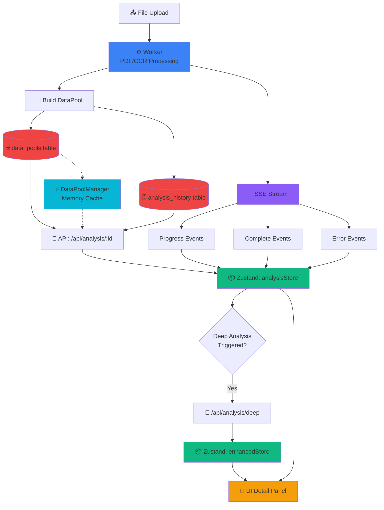

# 🔄 Procheff-v3 Data Flow Diagram

> **Bu diyagram sana ne kazandırır?**
> - Sistem akışını debug ederken nerede kırılma olduğunu 3 saniyede görürsün
> - `data_pools` yoksa → AI katmanı çöker
> - `analysis_history` yoksa → UI otomatik güncelleme gelmez  
> - Worker→SSE→Zustand zincirini görebilirsin
> - Deep analysis neden tetiklenmiyor → anında görürsün
> - Kod & mimari tutarlılık sağlanır

---

## 🎯 Genel Sistem Akışı



---

## 📋 Detaylı Veri Akış Katmanları

### 1️⃣ Upload & Processing Layer

```
┌─────────────────────────────────────────────────────────────┐
│  UltimateFileUploader.tsx                                   │
│  ┌───────────────────────────────────────────────────────┐  │
│  │ File Upload                                           │  │
│  │  - Drag & drop / file picker                          │  │
│  │  - Hash calculation                                   │  │
│  │  - Duplicate detection                                │  │
│  └───────────────┬───────────────────────────────────────┘  │
│                  │                                           │
│                  ▼                                           │
│  ┌───────────────────────────────────────────────────────┐  │
│  │ POST /api/analysis/process-single                     │  │
│  │  - PDF text extraction                                │  │
│  │  - OCR if needed                                      │  │
│  │  - JSON/CSV/TXT parsing                               │  │
│  │  - Table detection                                    │  │
│  │  - Entity extraction                                  │  │
│  └───────────────┬───────────────────────────────────────┘  │
│                  │                                           │
│                  ▼                                           │
│  ┌───────────────────────────────────────────────────────┐  │
│  │ buildDataPool()                                       │  │
│  │  - Merge all extracted data                           │  │
│  │  - Generate document IDs (A, B, C...)                 │  │
│  │  - Create DataPool object                             │  │
│  └───────────────┬───────────────────────────────────────┘  │
└──────────────────┼───────────────────────────────────────────┘
                   │
                   ▼
```

**Kod Lokasyonu:**
- `src/app/analysis/components/UltimateFileUploader.tsx:103-2046`
- `src/app/api/analysis/process-single/route.ts`
- `src/lib/document-processor/build-data-pool.ts`

---

### 2️⃣ Storage Layer (Dual Write)

```
DataPool Object
     │
     ├─────────────────────────┬──────────────────────────┐
     │                         │                          │
     ▼                         ▼                          ▼
┌──────────────┐    ┌────────────────────┐    ┌──────────────────┐
│ data_pools   │    │ analysis_history   │    │ DataPoolManager  │
│ (new table)  │    │ (legacy table)     │    │ (memory cache)   │
├──────────────┤    ├────────────────────┤    ├──────────────────┤
│ analysis_id  │    │ id                 │    │ Map<id, entry>   │
│ data_pool_   │    │ data_pool (JSON)   │    │ - timestamp      │
│   json       │    │ status             │    │ - ttl            │
│ expires_at   │    │ input_files        │    │ - dataPool       │
│ document_    │    │ created_at         │    └──────────────────┘
│   count      │    │ updated_at         │           ↑
│ table_count  │    └────────────────────┘           │
│ ...          │                                     │
└──────────────┘                        Cache Hit (1h TTL)
     ↑                                               │
     │                                               │
     └───────────────────────────────────────────────┘
             AnalysisRepository.saveDataPool()
               (with transaction + validation)
```

**Kod Lokasyonu:**
- `src/lib/db/analysis-repository.ts:232-283` (saveDataPool)
- `src/lib/state/data-pool-manager.ts:87-200` (save method)
- `src/lib/db/migrations/003_analysis_repository.sql` (schema)

**Dual Write Stratejisi:**
```typescript
// src/lib/state/data-pool-manager.ts
static async save(analysisId: string, dataPool: DataPool) {
  // 1. Save to NEW data_pools table (primary)
  AnalysisRepository.saveDataPool(analysisId, dataPool, 24);
  
  // 2. Save to LEGACY analysis_history (backward compatibility)
  try {
    if (tableExists('analysis_history')) {
      db.prepare('INSERT/UPDATE ...').run(...);
    }
  } catch (error) {
    // Optional - don't fail if legacy table missing
    AILogger.warn('Legacy save failed', { error });
  }
  
  // 3. Update memory cache
  this.setCache(analysisId, dataPool);
  
  // 4. Emit event for frontend sync
  DataPoolEventEmitter.emit(analysisId, dataPool);
}
```

---

### 3️⃣ SSE Streaming Layer

```
Worker (Process-Single Route)
     │
     ├─ SSE Stream Started (/api/analysis/process-single)
     │
     ├─► { type: 'progress', stage: 'text', progress: 20 }
     │     └─► Frontend: Update file.status = 'parsing'
     │
     ├─► { type: 'progress', stage: 'ocr', progress: 50 }
     │     └─► Frontend: Update file.status = 'extracting'
     │
     ├─► { type: 'progress', stage: 'datapool', progress: 80 }
     │     └─► Frontend: Update file.status = 'analyzing'
     │
     └─► { type: 'success', dataPool: {...}, metrics: {...} }
           └─► Frontend: 
                 - file.status = 'complete'
                 - Save to Zustand
                 - Trigger deep analysis
```

**Event Types:**
```typescript
// SSE Event Interface
interface SSEEvent {
  type: 'progress' | 'success' | 'error' | 'complete';
  stage?: 'upload' | 'hash' | 'text' | 'ocr' | 'datapool' | 'complete';
  progress?: number;
  message?: string;
  dataPool?: DataPool;
  metrics?: FileMetrics;
  error?: string;
}
```

**Kod Lokasyonu:**
- `src/lib/utils/sse-stream.ts:6-155`
- `src/app/api/analysis/process-single/route.ts` (SSE sender)
- `src/app/analysis/components/UltimateFileUploader.tsx:296-369` (SSE receiver)

---

### 4️⃣ Zustand State Management (Frontend)

```
┌────────────────────────────────────────────────────────────┐
│  Frontend Zustand Stores                                   │
│                                                            │
│  ┌──────────────────────────────────────────────────────┐ │
│  │ analysisStore.ts (Primary)                           │ │
│  │ ┌──────────────────────────────────────────────────┐ │ │
│  │ │ State:                                           │ │ │
│  │ │  - currentAnalysis: AnalysisResult | null        │ │ │
│  │ │  - history: AnalysisResult[]                     │ │ │
│  │ │  - currentStage: AnalysisStage                   │ │ │
│  │ │  - stageProgress: Record<stage, progress>        │ │ │
│  │ │  - error: string | null                          │ │ │
│  │ └──────────────────────────────────────────────────┘ │ │
│  │ ┌──────────────────────────────────────────────────┐ │ │
│  │ │ Actions:                                         │ │ │
│  │ │  - setDataPool(dataPool)                         │ │ │
│  │ │  - setContextualAnalysis(analysis)               │ │ │
│  │ │  - setMarketAnalysis(analysis)                   │ │ │
│  │ │  - setDeepAnalysis(analysis)                     │ │ │
│  │ │  - setStage(stage, progress)                     │ │ │
│  │ │  - completeAnalysis(scores)                      │ │ │
│  │ └──────────────────────────────────────────────────┘ │ │
│  └──────────────────────────────────────────────────────┘ │
│                                                            │
│  ┌──────────────────────────────────────────────────────┐ │
│  │ enhancedAnalysisStore.ts (Extended Features)         │ │
│  │ ┌──────────────────────────────────────────────────┐ │ │
│  │ │ State:                                           │ │ │
│  │ │  - results: Map<id, AnalysisResult>              │ │ │
│  │ │  - currentResultId: string | null                │ │ │
│  │ │  - activeTab: string                             │ │ │
│  │ │  - expandedCards: Set<string>                    │ │ │
│  │ │  - cache: Map<string, CachedData>                │ │ │
│  │ └──────────────────────────────────────────────────┘ │ │
│  └──────────────────────────────────────────────────────┘ │
└────────────────────────────────────────────────────────────┘
```

**Data Flow into Zustand:**

1. **SSE → Zustand (Real-time)**
```typescript
// UltimateFileUploader.tsx:332-343
if (data.type === 'success' && data.dataPool) {
  // Update Zustand immediately
  const { setDataPool } = useAnalysisStore.getState();
  setDataPool(data.dataPool);
}
```

2. **API → Zustand (Page Load)**
```typescript
// analysis/[id]/page.tsx:75-82
const response = await fetch(`/api/analysis/${id}`);
const data = await response.json();

setDataPool(data.dataPool);
setStatus(data.status);
```

3. **EventEmitter → Zustand (Background Sync)**
```typescript
// analysis/[id]/page.tsx:149-154
DataPoolEventEmitter.on(id, (updatedDataPool) => {
  setDataPool(updatedDataPool);
  const { setDataPool: setStoreDataPool } = useAnalysisStore.getState();
  setStoreDataPool(updatedDataPool);
});
```

**Kod Lokasyonu:**
- `src/store/analysisStore.ts:109-410`
- `src/store/enhancedAnalysisStore.ts:1-360`

---

### 5️⃣ UI Detail Panel (Data Consumer)

```
┌───────────────────────────────────────────────────────────────┐
│  UI Detail Panel (analysis/[id]/page.tsx)                     │
│                                                               │
│  Data Sources (2):                                            │
│  ┌─────────────────────┐    ┌──────────────────────────────┐ │
│  │ 1. DataPool         │    │ 2. analysis_history          │ │
│  │    (via API/Store)  │    │    (via polling/EventSource) │ │
│  └──────────┬──────────┘    └────────┬─────────────────────┘ │
│             │                         │                       │
│             └────────────┬────────────┘                       │
│                          ▼                                    │
│            ┌──────────────────────────────┐                  │
│            │  UI Components:              │                  │
│            │  - EnhancedAnalysisResults   │                  │
│            │  - AnalysisTabs              │                  │
│            │  - DataPoolViewer            │                  │
│            │  - ContextualAnalysisCard    │                  │
│            │  - MarketAnalysisCard        │                  │
│            └──────────────────────────────┘                  │
└───────────────────────────────────────────────────────────────┘
```

**Data Fetching Strategy:**

```typescript
// 1. Check Zustand Store First
let analysis = getAnalysisById(id);
if (analysis?.dataPool) {
  setDataPool(analysis.dataPool);
  return; // ✅ Fast path - no API call
}

// 2. Fetch from API if not in store
const response = await fetch(`/api/analysis/${id}`);
const data = await response.json();
setDataPool(data.dataPool);

// 3. Start polling if processing
if (data.status === 'processing') {
  startPolling(); // Every 3s check status
}

// 4. Subscribe to real-time updates
DataPoolEventEmitter.on(id, (updatedDataPool) => {
  setDataPool(updatedDataPool); // ✅ Real-time sync
});
```

**Kod Lokasyonu:**
- `src/app/analysis/[id]/page.tsx:31-453`
- `src/app/analysis/components/EnhancedAnalysisResults.tsx`

---

## 🔍 Debug Cheatsheet

### Problem: DataPool Yüklenmiyor

**Kontrol Noktaları:**
```bash
# 1. Database'de data var mı?
sqlite3 procheff.db "SELECT analysis_id, document_count FROM data_pools WHERE analysis_id = 'YOUR_ID';"

# 2. Cache'de var mı?
# Console'da:
DataPoolManager.cache.has('YOUR_ID')

# 3. API çalışıyor mu?
curl http://localhost:3000/api/analysis/YOUR_ID

# 4. Zustand'da var mı?
# Console'da:
useAnalysisStore.getState().currentAnalysis
```

**Olası Sorunlar:**
- ❌ `data_pools` table yok → Migration çalıştır
- ❌ `analysis_history` table yok → `initAuthSchema()` çalıştır
- ❌ SSE stream bağlantısı koptu → Network tab kontrol et
- ❌ EventEmitter unsubscribe edildi → Component mount check

---

### Problem: Deep Analysis Tetiklenmiyor

**Akış:**
```
File Complete (status='complete')
  ↓
UltimateFileUploader triggers navigation
  ↓
/analysis/[id] page loads
  ↓
DataPool fetched successfully
  ↓
User clicks "Derin Analiz" tab
  ↓
POST /api/analysis/deep → ❌ Burada kırılma?
```

**Kontrol:**
```typescript
// 1. DataPool tam mı?
console.log(dataPool?.documents?.length); // > 0 olmalı
console.log(dataPool?.tables?.length);    // > 0 olmalı

// 2. API endpoint var mı?
fetch('/api/analysis/deep', {
  method: 'POST',
  body: JSON.stringify({ analysisId, dataPool })
});

// 3. Response kontrol
// Network tab'da 200 OK mi? 500 error mı?
```

---

### Problem: UI Otomatik Güncellenmiyor

**EventEmitter Chain:**
```
DataPoolManager.save()
  → DataPoolEventEmitter.emit(analysisId, dataPool)
  → UI Component listens via .on()
  → setState(updatedDataPool) ❌ Bu çalışıyor mu?
```

**Kontrol:**
```typescript
// 1. EventEmitter registered mı?
console.log(DataPoolEventEmitter.listenerCount(analysisId));

// 2. Component mounted mı?
useEffect(() => {
  console.log('Subscribed to', analysisId);
  const unsubscribe = DataPoolEventEmitter.on(id, handler);
  return () => {
    console.log('Unsubscribed from', analysisId);
    unsubscribe();
  };
}, [analysisId]);
```

---

## 🎯 Best Practices

### ✅ DO

1. **Single Source of Truth**
   ```typescript
   // ✅ DataPoolManager is the source of truth
   const dataPool = await DataPoolManager.get(analysisId);
   ```

2. **Cache First Strategy**
   ```typescript
   // ✅ Check cache → Check DB → Fetch API
   let data = cache.get(id);
   if (!data) data = await db.get(id);
   if (!data) data = await api.fetch(id);
   ```

3. **Event-Driven Updates**
   ```typescript
   // ✅ Emit events for real-time sync
   DataPoolManager.save(id, dataPool);
   // → Automatically emits event
   // → UI subscribes and updates
   ```

4. **Transaction for Dual Writes**
   ```typescript
   // ✅ Atomic operation
   const saveTransaction = transaction(() => {
     saveToDataPools(dataPool);
     saveToAnalysisHistory(dataPool);
     updateCache(dataPool);
   });
   saveTransaction();
   ```

### ❌ DON'T

1. **Direct DB Access from UI**
   ```typescript
   // ❌ NO
   const db = getDB();
   const data = db.prepare('SELECT ...').get();
   
   // ✅ YES
   const data = await DataPoolManager.get(id);
   ```

2. **Multiple State Sources**
   ```typescript
   // ❌ NO - state fragmentation
   const [localDataPool, setLocalDataPool] = useState();
   const storeDataPool = useAnalysisStore(s => s.dataPool);
   
   // ✅ YES - single source
   const dataPool = useAnalysisStore(s => s.currentAnalysis?.dataPool);
   ```

3. **Polling Without Timeout**
   ```typescript
   // ❌ NO - infinite polling
   setInterval(poll, 3000);
   
   // ✅ YES - with max attempts
   let attempts = 0;
   const interval = setInterval(() => {
     if (++attempts > 20) clearInterval(interval);
     poll();
   }, 3000);
   ```

---

## 📊 Performance Metrics

### Cache Hit Rate
```typescript
// DataPoolManager stats
static getStats() {
  return {
    cacheSize: this.cache.size,
    maxSize: this.MAX_CACHE_SIZE,
    hitRate: this.cacheHits / (this.cacheHits + this.cacheMisses)
  };
}
```

### SSE Latency
```typescript
// Measure SSE event latency
const start = Date.now();
eventSource.onmessage = (e) => {
  const latency = Date.now() - start;
  console.log(`SSE latency: ${latency}ms`);
};
```

### API Response Time
```typescript
// Measure API response time
const start = Date.now();
const response = await fetch('/api/analysis/:id');
const duration = Date.now() - start;
console.log(`API response: ${duration}ms`);
```

---

## 🔗 Related Documentation

- [Database Best Practices](./DATABASE-BEST-PRACTICES.md)
- [Analysis Architecture](./analysis-architecture.md)
- [Pipeline Guide](../PIPELINE-GUIDE.md)
- [Architecture Analysis](./ARCHITECTURE-ANALYSIS.md)

---

Son Güncelleme: 2025-11-12

