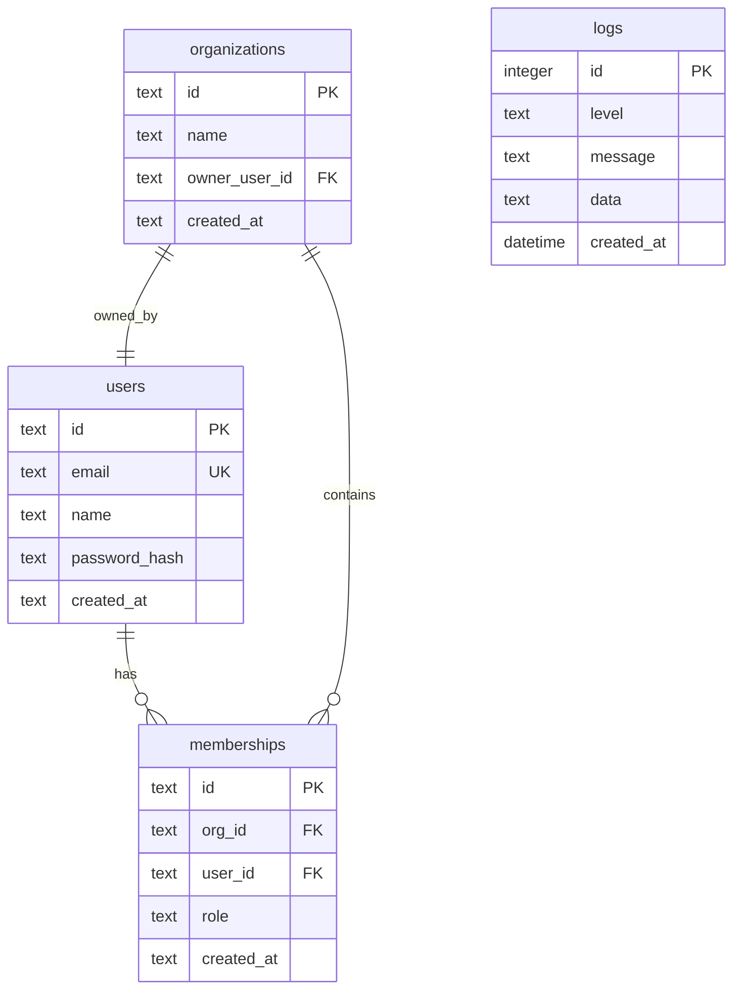
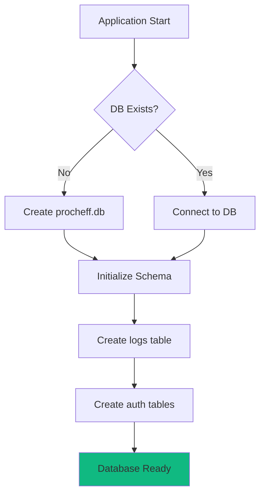

# 🗄️ Procheff-v3 Database Documentation

**Database Engine**: SQLite 3
**Driver**: better-sqlite3 ^11.10.0
**File Location**: `procheff.db` (project root)
**Last Updated**: November 10, 2025

## 📋 Table of Contents

- [Overview](#overview)
- [Database Schema](#database-schema)
- [Table Definitions](#table-definitions)
- [Relationships](#relationships)
- [Initialization](#initialization)
- [Queries](#queries)
- [Best Practices](#best-practices)

---

## Overview

Procheff-v3 uses **SQLite** as its database engine for structured logging, user management, and organizational data persistence.

### Why SQLite?

- ✅ **Zero Configuration**: No separate database server required
- ✅ **Serverless**: Embedded in the application
- ✅ **ACID Compliant**: Full transaction support
- ✅ **Fast**: Excellent for read-heavy workloads
- ✅ **Portable**: Single file database
- ✅ **Reliable**: Production-grade for < 100k requests/day

### Database File

```bash
Location: /procheff-v3/procheff.db
Size: ~2-10 MB (varies with log volume)
Format: SQLite 3
Encoding: UTF-8
```

**Note:** The database file is automatically created on first application run.

---

## Database Schema

### Entity Relationship Diagram



### Schema Overview

| Table | Purpose | Relationships |
|-------|---------|---------------|
| `users` | User accounts | → memberships |
| `organizations` | Organizations/workspaces | → memberships, → users (owner) |
| `memberships` | User-organization links | ← users, ← organizations |
| `logs` | AI operation logs | None (standalone) |
| `notifications` | Alert notifications | None (standalone) |

---

## Table Definitions

### 1. `logs` Table

**Purpose:** Stores all AI operation logs for monitoring and debugging

**Schema:**
```sql
CREATE TABLE IF NOT EXISTS logs (
  id INTEGER PRIMARY KEY AUTOINCREMENT,
  level TEXT NOT NULL,
  message TEXT NOT NULL,
  data TEXT,
  created_at DATETIME DEFAULT CURRENT_TIMESTAMP
)
```

**Columns:**

| Column | Type | Constraints | Description |
|--------|------|-------------|-------------|
| `id` | INTEGER | PRIMARY KEY, AUTO INCREMENT | Unique log entry ID |
| `level` | TEXT | NOT NULL | Log level: info, success, warn, error |
| `message` | TEXT | NOT NULL | Human-readable log message |
| `data` | TEXT | NULL | JSON-encoded additional data |
| `created_at` | DATETIME | DEFAULT CURRENT_TIMESTAMP | Timestamp of log entry |

**Log Levels:**
- `info` - Informational messages
- `success` - Successful operations
- `warn` - Warning messages
- `error` - Error messages

**Example Row:**
```json
{
  "id": 123,
  "level": "success",
  "message": "Claude analysis completed",
  "data": "{\"model\":\"claude-sonnet-4-20250514\",\"tokens\":1250,\"duration\":2.3}",
  "created_at": "2025-11-10 12:30:45"
}
```

**Indexes:**
```sql
-- Recommended for production
CREATE INDEX idx_logs_level ON logs(level);
CREATE INDEX idx_logs_created_at ON logs(created_at DESC);
```

---

### 2. `users` Table

**Purpose:** User account management

**Schema:**
```sql
CREATE TABLE IF NOT EXISTS users (
  id TEXT PRIMARY KEY,
  email TEXT UNIQUE NOT NULL,
  name TEXT,
  password_hash TEXT NOT NULL,
  created_at TEXT DEFAULT CURRENT_TIMESTAMP
);
```

**Columns:**

| Column | Type | Constraints | Description |
|--------|------|-------------|-------------|
| `id` | TEXT | PRIMARY KEY | UUID v4 user identifier |
| `email` | TEXT | UNIQUE, NOT NULL | User email address |
| `name` | TEXT | NULL | User display name |
| `password_hash` | TEXT | NOT NULL | bcrypt hashed password |
| `created_at` | TEXT | DEFAULT CURRENT_TIMESTAMP | Account creation timestamp |

**Password Hashing:**
- Algorithm: bcrypt
- Rounds: 10
- Library: bcryptjs

**Example Row:**
```json
{
  "id": "550e8400-e29b-41d4-a716-446655440000",
  "email": "user@example.com",
  "name": "John Doe",
  "password_hash": "$2a$10$N9qo8uLOickgx2ZMRZoMyeIjZAgcfl7p92ldGxad68LJZdL17lhWy",
  "created_at": "2025-11-10T10:00:00Z"
}
```

**Security:**
- Passwords never stored in plaintext
- bcrypt automatically salts each password
- Hashes are non-reversible

---

### 3. `organizations` Table

**Purpose:** Organization/workspace management

**Schema:**
```sql
CREATE TABLE IF NOT EXISTS organizations (
  id TEXT PRIMARY KEY,
  name TEXT NOT NULL,
  owner_user_id TEXT NOT NULL,
  created_at TEXT DEFAULT CURRENT_TIMESTAMP
);
```

**Columns:**

| Column | Type | Constraints | Description |
|--------|------|-------------|-------------|
| `id` | TEXT | PRIMARY KEY | UUID v4 organization identifier |
| `name` | TEXT | NOT NULL | Organization display name |
| `owner_user_id` | TEXT | NOT NULL, FK → users.id | Organization owner |
| `created_at` | TEXT | DEFAULT CURRENT_TIMESTAMP | Creation timestamp |

**Example Row:**
```json
{
  "id": "org-660e8400-e29b-41d4-a716-446655440001",
  "name": "Acme Corporation",
  "owner_user_id": "550e8400-e29b-41d4-a716-446655440000",
  "created_at": "2025-11-10T10:05:00Z"
}
```

**Business Logic:**
- Each user can own multiple organizations
- Organizations can have multiple members
- Owner has full control over organization

---

### 4. `memberships` Table

**Purpose:** User-organization relationships with roles

**Schema:**
```sql
CREATE TABLE IF NOT EXISTS memberships (
  id TEXT PRIMARY KEY,
  org_id TEXT NOT NULL,
  user_id TEXT NOT NULL,
  role TEXT NOT NULL,
  created_at TEXT DEFAULT CURRENT_TIMESTAMP,
  UNIQUE(org_id, user_id)
);
```

**Columns:**

| Column | Type | Constraints | Description |
|--------|------|-------------|-------------|
| `id` | TEXT | PRIMARY KEY | Composite: `{org_id}:{user_id}` |
| `org_id` | TEXT | NOT NULL, FK → organizations.id | Organization reference |
| `user_id` | TEXT | NOT NULL, FK → users.id | User reference |
| `role` | TEXT | NOT NULL | User role in organization |
| `created_at` | TEXT | DEFAULT CURRENT_TIMESTAMP | Membership start timestamp |

**Roles:**

| Role | Permissions | Description |
|------|-------------|-------------|
| `OWNER` | Full access | Organization owner |
| `ADMIN` | Manage members, view all data | Administrator |
| `ANALYST` | Analyze, create reports | Analyst |
| `VIEWER` | Read-only access | Viewer |

**Example Row:**
```json
{
  "id": "org-660e8400:550e8400",
  "org_id": "org-660e8400-e29b-41d4-a716-446655440001",
  "user_id": "550e8400-e29b-41d4-a716-446655440000",
  "role": "OWNER",
  "created_at": "2025-11-10T10:05:00Z"
}
```

**Constraints:**
- `UNIQUE(org_id, user_id)` - User can only have one role per organization
- Foreign keys ensure referential integrity

---

### 5. `notifications` Table

**Purpose:** Store alert notifications from the Smart Alerting system

**Schema:**
```sql
CREATE TABLE IF NOT EXISTS notifications (
  id INTEGER PRIMARY KEY AUTOINCREMENT,
  level TEXT NOT NULL,
  message TEXT NOT NULL,
  is_read INTEGER DEFAULT 0,
  created_at TEXT DEFAULT CURRENT_TIMESTAMP
);
```

**Columns:**

| Column | Type | Constraints | Description |
|--------|------|-------------|-------------|
| `id` | INTEGER | PRIMARY KEY, AUTO INCREMENT | Unique notification ID |
| `level` | TEXT | NOT NULL | Notification level: info, warn, error |
| `message` | TEXT | NOT NULL | Notification message |
| `is_read` | INTEGER | DEFAULT 0 | Read status (0 = unread, 1 = read) |
| `created_at` | TEXT | DEFAULT CURRENT_TIMESTAMP | Creation timestamp |

**Notification Levels:**
- `info` - Informational notifications (e.g., high activity)
- `warn` - Warning notifications (e.g., slow performance)
- `error` - Error notifications (e.g., high error rate)

**Example Row:**
```json
{
  "id": 45,
  "level": "error",
  "message": "Yüksek Hata Oranı: Son 24 saatte %7.2 hata oranı tespit edildi",
  "is_read": 0,
  "created_at": "2025-11-10T12:00:00Z"
}
```

**Indexes:**
```sql
-- Recommended for production
CREATE INDEX idx_notifications_is_read ON notifications(is_read);
CREATE INDEX idx_notifications_created_at ON notifications(created_at DESC);
CREATE INDEX idx_notifications_level ON notifications(level);
```

**Auto-Cleanup:**
- Notifications older than 30 days are automatically deleted
- Cleanup runs after each alert check (every 5 minutes)
- Query: `DELETE FROM notifications WHERE created_at < datetime('now', '-30 days')`

---

## Relationships

### 1. Users ↔ Organizations (Ownership)

```sql
-- One user owns many organizations
SELECT * FROM organizations WHERE owner_user_id = ?
```

**Relationship Type:** One-to-Many
**Foreign Key:** `organizations.owner_user_id` → `users.id`

### 2. Users ↔ Memberships

```sql
-- One user has many memberships
SELECT * FROM memberships WHERE user_id = ?
```

**Relationship Type:** One-to-Many
**Foreign Key:** `memberships.user_id` → `users.id`

### 3. Organizations ↔ Memberships

```sql
-- One organization has many members
SELECT * FROM memberships WHERE org_id = ?
```

**Relationship Type:** One-to-Many
**Foreign Key:** `memberships.org_id` → `organizations.id`

### 4. Complete User Organizations Query

```sql
-- Get all organizations for a user with their role
SELECT
  o.id,
  o.name,
  m.role
FROM organizations o
JOIN memberships m ON m.org_id = o.id
WHERE m.user_id = ?
ORDER BY o.created_at DESC
```

---

## Initialization

### Automatic Initialization

The database is automatically initialized on first application run.

**Initialization Flow:**



### Manual Initialization

**File:** `src/lib/db/sqlite-client.ts`

```typescript
import Database from "better-sqlite3";

let dbInstance: Database.Database | null = null;

export function getDB(): Database.Database {
  if (!dbInstance) {
    dbInstance = new Database("procheff.db");
    // Enable WAL mode for better concurrency
    dbInstance.pragma("journal_mode = WAL");
  }
  return dbInstance;
}
```

**File:** `src/lib/ai/logger.ts`

```typescript
private static initDB() {
  if (this.isInitialized) return;

  const db = getDB();
  db.prepare(`
    CREATE TABLE IF NOT EXISTS logs (
      id INTEGER PRIMARY KEY AUTOINCREMENT,
      level TEXT NOT NULL,
      message TEXT NOT NULL,
      data TEXT,
      created_at DATETIME DEFAULT CURRENT_TIMESTAMP
    )
  `).run();

  this.isInitialized = true;
}
```

**File:** `src/lib/db/init-auth.ts`

```typescript
export function initAuthSchema() {
  const db = getDB();

  // Create users table
  db.prepare(`CREATE TABLE IF NOT EXISTS users (...)`).run();

  // Create organizations table
  db.prepare(`CREATE TABLE IF NOT EXISTS organizations (...)`).run();

  // Create memberships table
  db.prepare(`CREATE TABLE IF NOT EXISTS memberships (...)`).run();
}
```

---

## Queries

### Common Query Patterns

#### 1. Insert Log Entry

```typescript
import { aiLogger } from "@/lib/ai/logger";

// Info log
aiLogger.info("Operation started", { operation: "analysis" });

// Success log
aiLogger.success("Analysis completed", {
  model: "claude-sonnet-4-20250514",
  tokens: 1250,
  duration: 2.3
});

// Error log
aiLogger.error("API call failed", {
  endpoint: "/api/ai/deep-analysis",
  error: "Timeout"
});
```

**SQL (internal):**
```sql
INSERT INTO logs (level, message, data)
VALUES (?, ?, ?)
```

#### 2. Query Logs

```typescript
import { getDB } from "@/lib/db/sqlite-client";

const db = getDB();

// Get recent logs
const logs = db.prepare(`
  SELECT * FROM logs
  ORDER BY created_at DESC
  LIMIT ?
`).all(50);

// Get error logs only
const errors = db.prepare(`
  SELECT * FROM logs
  WHERE level = 'error'
  ORDER BY created_at DESC
`).all();

// Get logs by date range
const rangedLogs = db.prepare(`
  SELECT * FROM logs
  WHERE created_at BETWEEN ? AND ?
  ORDER BY created_at DESC
`).all('2025-11-01', '2025-11-10');
```

#### 3. User Authentication

```typescript
import { findUserByEmail, verifyPassword } from "@/lib/db/init-auth";

// Find user
const user = findUserByEmail("user@example.com");

if (user && verifyPassword(user.password_hash, password)) {
  // Authentication successful
}
```

**SQL:**
```sql
SELECT * FROM users WHERE email = ?
```

#### 4. Create User

```typescript
import { createUser, createDefaultOrgForUser } from "@/lib/db/init-auth";

// Create user
const user = createUser({
  id: crypto.randomUUID(),
  email: "newuser@example.com",
  name: "New User",
  password: "securePassword123"
});

// Create default organization
createDefaultOrgForUser({
  orgId: crypto.randomUUID(),
  userId: user.id,
  orgName: "Personal Workspace"
});
```

#### 5. Get User Organizations

```typescript
import { getUserOrgs } from "@/lib/db/init-auth";

const orgs = getUserOrgs(userId);
// Returns: [{ id, name, role }, ...]
```

**SQL:**
```sql
SELECT o.id, o.name, m.role
FROM organizations o
JOIN memberships m ON m.org_id = o.id
WHERE m.user_id = ?
ORDER BY o.created_at DESC
```

#### 6. Metrics Query

```typescript
const db = getDB();

// Total logs
const total = db.prepare(`SELECT COUNT(*) as count FROM logs`).get();

// Success rate
const successRate = db.prepare(`
  SELECT
    (CAST(SUM(CASE WHEN level = 'success' THEN 1 ELSE 0 END) AS REAL) / COUNT(*)) * 100 as rate
  FROM logs
`).get();

// Average duration (from JSON data)
const avgDuration = db.prepare(`
  SELECT AVG(json_extract(data, '$.duration')) as avg_duration
  FROM logs
  WHERE level = 'success' AND data LIKE '%duration%'
`).get();
```

#### 7. Notification Queries

```typescript
import {
  getNotifications,
  getUnreadCount,
  markAsRead,
  markAllAsRead,
  createNotification
} from "@/lib/alerts/notifier";

// Get recent notifications
const notifications = getNotifications({ limit: 50, unreadOnly: false });

// Get unread notifications only
const unread = getNotifications({ limit: 50, unreadOnly: true });

// Get unread count
const count = getUnreadCount();

// Mark as read
markAsRead(45);

// Mark all as read
markAllAsRead();

// Create notification
const id = createNotification({
  level: "error",
  message: "System alert message",
  action: "/logs?level=error"
});
```

**SQL (internal):**
```sql
-- Get notifications
SELECT * FROM notifications
WHERE (is_read = 0 OR ?)  -- unreadOnly filter
ORDER BY created_at DESC
LIMIT ?

-- Get unread count
SELECT COUNT(*) as count
FROM notifications
WHERE is_read = 0

-- Mark as read
UPDATE notifications
SET is_read = 1
WHERE id = ?

-- Mark all as read
UPDATE notifications
SET is_read = 1
WHERE is_read = 0

-- Create notification
INSERT INTO notifications (level, message)
VALUES (?, ?)

-- Cleanup old notifications
DELETE FROM notifications
WHERE created_at < datetime('now', '-30 days')
```

---

## Best Practices

### 1. Use Prepared Statements

✅ **Good:**
```typescript
const stmt = db.prepare("SELECT * FROM logs WHERE level = ?");
const logs = stmt.all("error");
```

❌ **Bad:**
```typescript
const logs = db.prepare(`SELECT * FROM logs WHERE level = '${level}'`).all();
// Vulnerable to SQL injection!
```

### 2. Singleton Pattern

✅ **Good:**
```typescript
import { getDB } from "@/lib/db/sqlite-client";

const db = getDB(); // Reuses existing connection
```

❌ **Bad:**
```typescript
import Database from "better-sqlite3";

const db = new Database("procheff.db"); // Creates new connection every time
```

### 3. Transaction for Multiple Operations

✅ **Good:**
```typescript
const insertUser = db.prepare("INSERT INTO users ...");
const insertOrg = db.prepare("INSERT INTO organizations ...");
const insertMembership = db.prepare("INSERT INTO memberships ...");

const transaction = db.transaction(() => {
  insertUser.run(...);
  insertOrg.run(...);
  insertMembership.run(...);
});

transaction(); // Atomic operation
```

### 4. Index for Performance

```sql
-- Create indexes on frequently queried columns
CREATE INDEX idx_logs_level ON logs(level);
CREATE INDEX idx_logs_created_at ON logs(created_at DESC);
CREATE INDEX idx_memberships_user ON memberships(user_id);
CREATE INDEX idx_memberships_org ON memberships(org_id);
```

### 5. Data Cleanup

```typescript
// Clean old logs (older than 90 days)
db.prepare(`
  DELETE FROM logs
  WHERE created_at < datetime('now', '-90 days')
`).run();

// Vacuum database to reclaim space
db.prepare("VACUUM").run();
```

---

## Performance Optimization

### WAL Mode

**Write-Ahead Logging** enables better concurrency:

```typescript
db.pragma("journal_mode = WAL");
```

**Benefits:**
- Readers don't block writers
- Writers don't block readers
- Faster write performance

### Connection Pooling

SQLite doesn't support connection pooling like PostgreSQL, but the singleton pattern ensures efficient connection reuse.

### Query Optimization

```sql
-- Use EXPLAIN QUERY PLAN to analyze queries
EXPLAIN QUERY PLAN
SELECT * FROM logs WHERE level = 'error';

-- Add indexes based on query patterns
CREATE INDEX idx_logs_level ON logs(level);
```

---

## Backup & Recovery

### Backup Strategy

**Manual Backup:**
```bash
# Copy database file
cp procheff.db procheff_backup_$(date +%Y%m%d).db

# Or use SQLite backup command
sqlite3 procheff.db ".backup procheff_backup.db"
```

**Automated Backup (recommended):**
```typescript
import { getDB } from "@/lib/db/sqlite-client";

function backupDatabase(backupPath: string) {
  const db = getDB();
  db.backup(backupPath);
}

// Run daily
setInterval(() => {
  const date = new Date().toISOString().split('T')[0];
  backupDatabase(`./backups/procheff_${date}.db`);
}, 24 * 60 * 60 * 1000);
```

### Recovery

```bash
# Restore from backup
cp procheff_backup.db procheff.db

# Verify integrity
sqlite3 procheff.db "PRAGMA integrity_check;"
```

---

## Migration Strategy

### Current: Manual Schema Updates

Tables are created with `IF NOT EXISTS`, allowing safe re-runs.

### Future: Migration System

**Recommendation:** Implement migration tracking:

```sql
CREATE TABLE IF NOT EXISTS migrations (
  id INTEGER PRIMARY KEY AUTOINCREMENT,
  version TEXT UNIQUE NOT NULL,
  applied_at DATETIME DEFAULT CURRENT_TIMESTAMP
);
```

**Example Migration:**
```typescript
function runMigration(version: string, sql: string) {
  const db = getDB();
  const applied = db.prepare("SELECT version FROM migrations WHERE version = ?").get(version);

  if (!applied) {
    db.exec(sql);
    db.prepare("INSERT INTO migrations (version) VALUES (?)").run(version);
  }
}

// Usage
runMigration("001_add_user_avatar", `
  ALTER TABLE users ADD COLUMN avatar_url TEXT;
`);
```

---

## Troubleshooting

### Common Issues

**1. Database Locked**
```
Error: database is locked
```

**Solution:** Enable WAL mode:
```typescript
db.pragma("journal_mode = WAL");
```

**2. File Not Found**
```
Error: unable to open database file
```

**Solution:** Check file permissions and path:
```bash
ls -la procheff.db
chmod 644 procheff.db
```

**3. Corrupt Database**
```
Error: database disk image is malformed
```

**Solution:** Restore from backup or recover:
```bash
sqlite3 procheff.db ".recover" | sqlite3 recovered.db
```

---

## Related Documentation

- [Architecture Guide](./ARCHITECTURE.md) - System overview
- [Setup Guide](./SETUP.md) - Installation and configuration
- [AI Logger](../AI-LOGGER-README.md) - Logging system details
- [SQLite Documentation](https://www.sqlite.org/docs.html) - Official SQLite docs

---

**Last Updated:** November 10, 2025
**Database Version:** 1.0.0
**Maintainer:** Procheff Development Team
