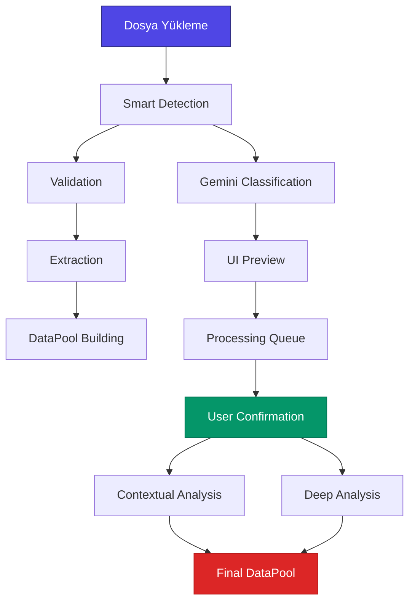
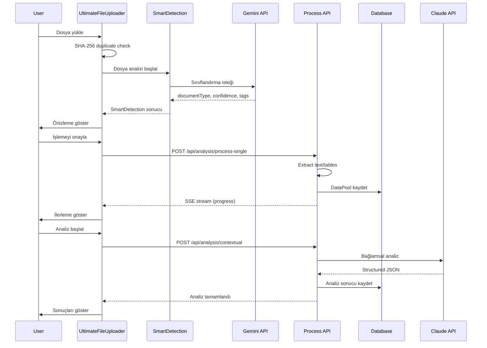
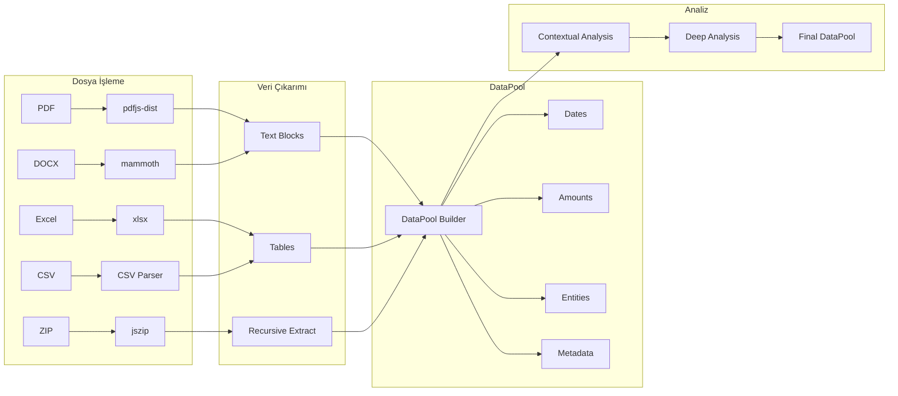
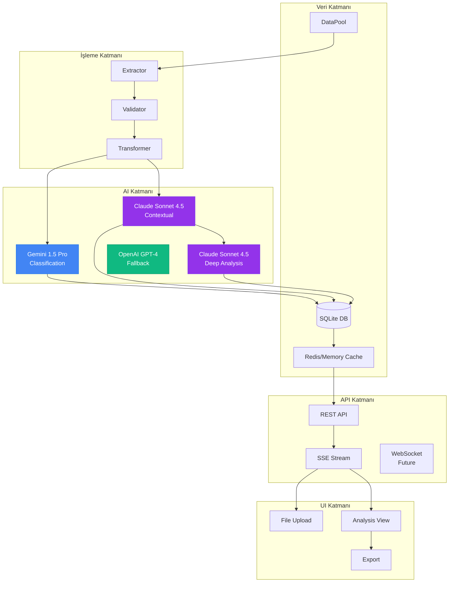
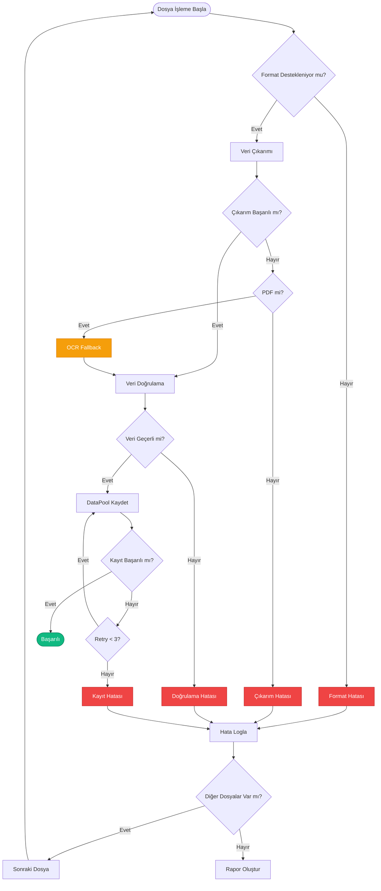
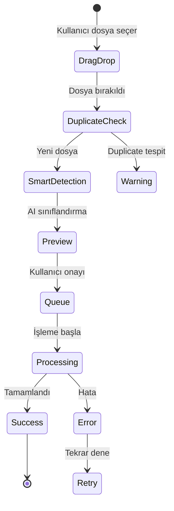
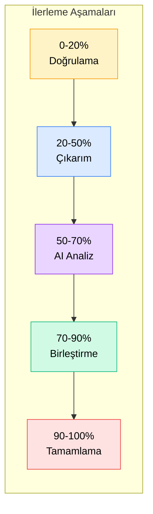

# Analysis Architecture Documentation

## İçindekiler
1. [Sistem Felsefesi](#1-sistem-felsefesi)
2. [Veri Akış Mimarisi](#2-veri-akış-mimarisi)
3. [Modül Dökümantasyonu](#3-modül-dökümantasyonu)
4. [İşleme Hattı Detayları](#4-işleme-hattı-detayları)
5. [Hata Yönetimi ve Kurtarma](#5-hata-yönetimi-ve-kurtarma)
6. [UI Davranış Modeli](#6-ui-davranış-modeli)
7. [Yapılandırma ve Ortam](#7-yapılandırma-ve-ortam)
8. [Geliştirme Kılavuzları](#8-geliştirme-kılavuzları)

---

## 1. Sistem Felsefesi

### Temel İlke
**"AI karar vermez, neden o sonuca vardığını anlatır"**

Bu sistem, yapay zekanın bir karar verici değil, bir analiz aracı olarak kullanıldığı bir mimari üzerine kurulmuştur. Her AI çıktısı şeffaf, denetlenebilir ve geri alınabilir olacak şekilde tasarlanmıştır.

### İnsan Kontrol Noktaları
1. **Dosya Doğrulama**: Yüklenen her dosya kullanıcı tarafından önizlenir
2. **İşleme Onayı**: Analiz başlatmadan önce kullanıcı onayı gerekir
3. **Analiz İncelemesi**: Her analiz katmanı ayrı ayrı incelenebilir

### Şeffaflık Katmanları
- **DataPool**: Ham veri ve çıkarımlar
- **Contextual**: Yapılandırılmış içgörüler
- **Deep Analysis**: Stratejik değerlendirmeler

### Mimari Hedefler
- ✅ **Açıklanabilir**: Her sonucun arkasındaki mantık görünür
- ✅ **Denetlenebilir**: Tüm işlemler loglanır ve izlenebilir
- ✅ **Geri Alınabilir**: Her aşama bağımsız çalışır ve tekrarlanabilir
- ✅ **İnsan Merkezli**: Kritik kararlar her zaman insana bırakılır

---

## 2. Veri Akış Mimarisi

### Genel Akış Diyagramı



### Detaylı Bileşen Etkileşimi



### DataPool Veri Akışı



### Detaylı Akış Tablosu

| Aşama | Girdi | İşlem | Çıktı | Kontrol |
|-------|-------|-------|-------|---------|
| Upload | File[] | MIME type kontrolü | FileItem[] | Kullanıcı seçimi |
| Smart Detection | File | Heuristik + AI analiz | SmartDetection | Otomatik |
| Validation | FileItem | Format ve boyut kontrolü | ValidatedFile | Otomatik |
| Extraction | ValidatedFile | Text/tablo çıkarımı | ExtractedData | Progress tracking |
| DataPool | ExtractedData[] | Veri birleştirme | DataPool | Kullanıcı onayı |
| Contextual | DataPool | Claude analizi | ContextualAnalysis | Manuel tetikleme |
| Deep | DataPool + Context | Derin AI analizi | DeepAnalysis | Manuel tetikleme |

---

## 3. Modül Dökümantasyonu

### 3.1 Temel İşleme Modülleri

#### [`src/lib/ai/smart-detection.ts`](../src/lib/ai/smart-detection.ts)
**Amaç**: Dosya türü tespiti ve içerik analizi

```typescript
export class AIDocumentDetector {
  static async detect(file: File): Promise<SmartDetection> {
    // 1. Heuristik analiz
    const textSample = await this.extractTextSample(file);
    let documentType = this.detectDocumentType(textSample);
    let confidence = this.calculateConfidence(textSample, documentType);
    
    // 2. Gemini AI desteği
    try {
      const geminiResult = await GeminiDocumentClassifier.classify(
        file.name, 
        textSample
      );
      if (geminiResult && geminiResult.confidence > confidence) {
        documentType = geminiResult.documentType;
        confidence = geminiResult.confidence;
      }
    } catch (e) {
      AILogger.warn('Gemini classification failed, using heuristics');
    }
    
    return { documentType, confidence, ...otherMetrics };
  }
}
```

#### [`src/lib/ai/gemini-document-classifier.ts`](../src/lib/ai/gemini-document-classifier.ts)
**Amaç**: Gemini 1.5 Pro ile akıllı doküman sınıflandırma

```typescript
export interface GeminiClassificationResult {
  documentType: 'İhale İlanı' | 'İdari Şartname' | 'Teknik Şartname' | 
                'Zeyilname' | 'Sözleşme Taslağı' | 'Fatura' | 
                'Menü' | 'Rapor' | 'Teklif' | 'Diğer';
  confidence: number; // 0-100
  tags: string[];
}
```

#### [`src/lib/document-processor/extractor.ts`](../src/lib/document-processor/extractor.ts)
**Amaç**: Çoklu format desteği ile veri çıkarımı

Desteklenen formatlar:
- PDF (pdfjs-dist)
- DOCX/DOC (mammoth)
- XLSX/XLS (xlsx)
- CSV (özel parser)
- TXT/RTF (text decoder)
- HTML (cheerio)
- JSON (native)
- ZIP (jszip - recursive extraction)

#### [`src/lib/document-processor/data-pool.ts`](../src/lib/document-processor/data-pool.ts)
**Amaç**: Birleştirilmiş veri havuzu oluşturma

```typescript
export async function buildDataPool(
  files: File[],
  options: ProcessingOptions,
  onProgress?: ProgressCallback
): Promise<ProcessingResult> {
  // 1. ZIP dosyalarını aç
  // 2. Tüm dosyaları işle
  // 3. Veriyi birleştir ve doğrula
  // 4. Metadata oluştur
}
```

### 3.2 Analiz Katmanları

#### [`src/lib/tender-analysis/contextual.ts`](../src/lib/tender-analysis/contextual.ts)
**Amaç**: Yapılandırılmış alan çıkarımı ve risk analizi

```typescript
export async function performContextualAnalysis(
  dataPool: DataPool,
  extractedFields: ExtractedFields
): Promise<ContextualAnalysis> {
  const prompt = buildContextualPrompt(dataPool, extractedFields);
  const result = await AIProviderFactory.createStructuredMessage(
    prompt,
    CONTEXTUAL_ANALYSIS_SCHEMA
  );
  return result.data;
}
```

#### [`src/app/api/analysis/process-single/route.ts`](../src/app/api/analysis/process-single/route.ts)
**Amaç**: Tek dosya işleme pipeline'ı (SSE stream)

```typescript
// Server-Sent Events ile gerçek zamanlı ilerleme
const stream = new SSEStream();
stream.sendProgress('Dosya işleniyor...', 10);
stream.sendProgress('Metin çıkarılıyor...', 30);
stream.sendProgress('Tablolar analiz ediliyor...', 60);
stream.sendSuccess({ dataPool, metrics });
```

#### [`src/app/api/analysis/start/route.ts`](../src/app/api/analysis/start/route.ts)
**Amaç**: Çoklu dosya analizi başlatma

### 3.3 UI Bileşenleri

#### [`src/app/analysis/components/UltimateFileUploader.tsx`](../src/app/analysis/components/UltimateFileUploader.tsx)
**Amaç**: Modern dosya yükleme deneyimi

Özellikler:
- Drag & drop desteği
- Klasör yükleme
- Duplicate kontrolü (SHA-256)
- Gerçek zamanlı ilerleme
- PDF thumbnail önizleme
- Akıllı dosya gruplama

#### [`src/app/analysis/[id]/page.tsx`](../src/app/analysis/[id]/page.tsx)
**Amaç**: 3 sekmeli analiz görünümü

Sekmeler:
1. **Veri Havuzu**: Ham veriler, aranabilir
2. **Bağlamsal**: Yapılandırılmış içgörüler
3. **Derin**: Stratejik tavsiyeler

#### [`src/components/analysis/RawDataView.tsx`](../src/components/analysis/RawDataView.tsx)
**Amaç**: Ham veri görselleştirme ve arama

---

## 4. İşleme Hattı Detayları

### Aşama 1: Smart Detection
```typescript
interface SmartDetection {
  documentType: string;        // AI tarafından belirlenen tür
  confidence: number;          // 0-100 güven skoru
  suggestedCategory: string;   // Kategori önerisi
  autoTags: string[];         // Otomatik etiketler
  language: 'TR' | 'EN' | 'OTHER';
  quality: 'Yüksek' | 'Orta' | 'Düşük';
  contentSummary: string;      // İlk 200 karakter
  keyEntities: string[];       // Önemli varlıklar
  estimatedProcessTime: number; // Tahmini süre (ms)
}
```

### Aşama 2: Extraction
Metin yoğunluğu kontrolü:
- PDF: %30'dan az metin → OCR fallback
- DOCX: Boş paragraf kontrolü
- Excel: Boş hücre oranı

### Aşama 3: DataPool Building
```typescript
interface DataPool {
  documents: DocumentInfo[]     // Dosya metadata
  textBlocks: TextBlock[]       // Metin parçaları
  tables: ExtractedTable[]      // Yapılandırılmış tablolar
  dates: ExtractedDate[]        // Zaman çizelgesi
  amounts: ExtractedAmount[]    // Finansal veriler
  entities: ExtractedEntity[]   // Kurum, kişi, yer
  rawText: string              // Ham metin (arama için)
  metadata: {
    total_files: number
    total_words: number
    total_pages: number
    creation_date: string
    file_types: string[]
    ocr_used: boolean
    languages_detected: string[]
    warnings: string[]
  }
  provenance: Map<string, SourceLocation>
}
```

### Aşama 4: Contextual Analysis
Claude Sonnet 4.5 ile yapılandırılmış çıktı:

```typescript
interface ContextualAnalysis {
  ihale_bilgileri: {
    kurum: string
    ihale_turu: string
    tahmini_bedel: string
    sure: string
    kisilik: number
  }
  operasyonel_riskler: {
    seviye: 'düşük' | 'orta' | 'yüksek'
    faktorler: RiskFactor[]
  }
  maliyet_analizi: {
    gunluk_kisi_basi: string
    toplam_tahmini: string
    kar_marji_onerisi: string
  }
  uyum_kontrol: {
    eksik_belgeler: string[]
    yasal_uyarilar: string[]
  }
  genel_degerlendirme: {
    puan: number // 0-100
    yorum: string
    oneriler: string[]
  }
}
```

### Aşama 5: Deep Analysis
Bağlamsal analiz + piyasa verileri birleştirilerek:
- Stratejik öneriler
- Rekabet analizi
- Uygulama yol haritası
- Risk matrisi

### Analiz Katmanları Mimarisi



---

## 5. Hata Yönetimi ve Kurtarma

### 5.1 Doğrulama Hataları

| Hata Tipi | Sebep | Çözüm | Kullanıcı Mesajı |
|-----------|-------|-------|------------------|
| UNSUPPORTED_FORMAT | Desteklenmeyen dosya | Format listesi göster | "Bu format desteklenmiyor. Desteklenen: PDF, DOCX..." |
| FILE_TOO_LARGE | >100MB dosya | Chunk upload öner | "Dosya çok büyük. Parçalı yükleme kullanın" |
| CORRUPTED_FILE | Bozuk dosya | OCR fallback dene | "Dosya bozuk görünüyor. OCR ile deneniyor..." |
| EMPTY_FILE | Boş dosya | Red et | "Dosya boş veya okunamıyor" |

### 5.2 İşleme Hataları

```typescript
// Exponential backoff ile retry
async function retryWithBackoff<T>(
  fn: () => Promise<T>,
  maxRetries = 3,
  baseDelay = 1000
): Promise<T> {
  for (let i = 0; i < maxRetries; i++) {
    try {
      return await fn();
    } catch (error) {
      if (i === maxRetries - 1) throw error;
      const delay = baseDelay * Math.pow(1.5, i);
      await new Promise(resolve => setTimeout(resolve, delay));
    }
  }
  throw new Error('Max retries exceeded');
}
```

### 5.3 Kısmi Başarısızlık Yönetimi

```typescript
interface ProcessingResult {
  success: boolean;
  dataPool: DataPool;
  errors: ProcessingError[];
  warnings: string[];
  metadata: {
    total_files: number;
    processed_files: number;
    failed_files: number;
    extraction_time_ms: number;
  };
}
```

### 5.4 Hata Akış Diyagramı



---

## 6. UI Davranış Modeli

### 6.1 Dosya Yükleme Akışı



### 6.2 İlerleme Görselleştirme

Her dosya için 5 aşamalı ilerleme:
1. **Doğrulama** (0-20%): Format ve boyut kontrolü
2. **Çıkarım** (20-50%): Metin ve tablo çıkarımı
3. **Analiz** (50-70%): AI sınıflandırma
4. **Birleştirme** (70-90%): DataPool oluşturma
5. **Tamamlama** (90-100%): Metadata ve indeksleme



### 6.3 Analiz Görünümü

#### Tab 1 - Veri Havuzu
- **Özet Kartlar**: Doküman, tablo, tarih, tutar sayıları
- **Arama**: Full-text arama tüm veride
- **Filtreleme**: Dosya türü, tarih aralığı
- **Dışa Aktarım**: CSV, JSON formatları

#### Tab 2 - Bağlamsal
- **Risk Matrisi**: Görsel risk haritası
- **Kritik Bilgiler**: Highlight edilmiş önemli veriler
- **Uyum Kontrol**: Eksik belge listesi
- **Maliyet Özeti**: Detaylı maliyet dağılımı

#### Tab 3 - Derin
- **Strateji Önerileri**: Aksiyona dönük tavsiyeler
- **SWOT Analizi**: Güçlü/zayıf yönler
- **Zaman Çizelgesi**: Kritik tarihler
- **Karar Destek**: Pros/cons listesi

---

## 7. Yapılandırma ve Ortam

### 7.1 Gerekli API Anahtarları

```bash
# .env.local
ANTHROPIC_API_KEY=sk-ant-api03-xxxxx    # Claude Sonnet 4.5
GOOGLE_API_KEY=AIzaSyxxxxx              # Gemini 1.5 Pro
OPENAI_API_KEY=sk-xxxxx                 # GPT-4 (opsiyonel)
```

### 7.2 Performans Ayarları

```typescript
// config/analysis.ts
export const ANALYSIS_CONFIG = {
  MAX_FILE_SIZE: 100 * 1024 * 1024,      // 100MB
  MAX_FILES_PER_UPLOAD: 50,               // Tek seferde max dosya
  CONCURRENT_UPLOADS: 5,                  // Paralel yükleme
  CHUNK_SIZE: 5 * 1024 * 1024,           // 5MB chunk
  ANALYSIS_TIMEOUT: 300_000,              // 5 dakika
  CACHE_TTL: 24 * 60 * 60 * 1000,        // 24 saat
  OCR_CONFIDENCE_THRESHOLD: 0.7,          // OCR güven eşiği
  MIN_TEXT_DENSITY: 0.3,                  // Min metin yoğunluğu
};
```

### 7.3 Veritabanı Konfigürasyonu

```sql
-- SQLite şema özeti
CREATE TABLE data_pools (
  id TEXT PRIMARY KEY,
  session_id TEXT NOT NULL,
  created_at DATETIME DEFAULT CURRENT_TIMESTAMP,
  data BLOB NOT NULL,
  metadata JSON,
  version INTEGER DEFAULT 1
);

CREATE TABLE analysis_history (
  id TEXT PRIMARY KEY,
  analysis_id TEXT NOT NULL,
  stage TEXT NOT NULL,
  input_data JSON,
  output_data JSON,
  duration_ms INTEGER,
  created_at DATETIME DEFAULT CURRENT_TIMESTAMP
);

CREATE INDEX idx_session ON data_pools(session_id);
CREATE INDEX idx_analysis ON analysis_history(analysis_id);
```

---

## 8. Geliştirme Kılavuzları

### 8.1 Yeni Doküman Tipi Ekleme

#### Örnek: "Güvenlik Raporu" Tipi Ekleme

1. **Smart Detection Güncelleme**
```typescript
// src/lib/ai/smart-detection.ts
private static readonly TYPE_KEYWORDS: Record<string, string[]> = {
  'İhale İlanı': ['ihale', 'ilan', 'duyuru', 'ihale ilanı', 'kamu ihale'],
  'İdari Şartname': ['idari şartname', 'idari', 'şartname'],
  'Teknik Şartname': ['teknik şartname', 'teknik', 'özellikler'],
  'Güvenlik Raporu': ['güvenlik', 'güvenlik raporu', 'risk değerlendirme', 'tehdit analizi'], // YENİ
};

// Kategori eşleştirmesi güncelle
private static readonly CATEGORY_MAP: Record<string, string> = {
  'İhale İlanı': 'İhale Dokümanları',
  'Güvenlik Raporu': 'Risk ve Güvenlik', // YENİ
  // ...
};
```

2. **Gemini Prompt Güncelleme**
```typescript
// src/lib/ai/gemini-document-classifier.ts
export interface GeminiClassificationResult {
  documentType: 'İhale İlanı' | 'İdari Şartname' | 'Teknik Şartname' | 
                'Zeyilname' | 'Sözleşme Taslağı' | 'Fatura' | 
                'Menü' | 'Rapor' | 'Teklif' | 'Güvenlik Raporu' | 'Diğer'; // YENİ
  confidence: number;
  tags: string[];
}

const CLASSIFICATION_PROMPT = `
Sen bir ihale dokümanı sınıflandırma asistanısın. 
Olası documentType değerleri: 'İhale İlanı', 'İdari Şartname', 'Teknik Şartname', 
'Zeyilname', 'Sözleşme Taslağı', 'Fatura', 'Menü', 'Rapor', 'Teklif', 
'Güvenlik Raporu', 'Diğer'.

Güvenlik Raporu özellikleri:
- Risk değerlendirmesi içerir
- Tehdit analizi bulunur
- Güvenlik önlemleri listelenir
- Acil durum prosedürleri vardır
`;
```

3. **Özel Extraction Logic (Opsiyonel)**
```typescript
// src/lib/document-processor/security-report-extractor.ts
export async function extractSecurityMetrics(
  textBlocks: TextBlock[],
  tables: ExtractedTable[]
): Promise<SecurityMetrics> {
  const metrics: SecurityMetrics = {
    riskLevel: 'unknown',
    threats: [],
    mitigations: [],
    complianceStatus: []
  };
  
  // Risk seviyesi tespiti
  const riskPatterns = /risk (seviyesi|level):\s*(düşük|orta|yüksek|kritik)/gi;
  for (const block of textBlocks) {
    const match = riskPatterns.exec(block.content);
    if (match) {
      metrics.riskLevel = match[2].toLowerCase() as RiskLevel;
    }
  }
  
  // Tehdit listesi çıkarımı
  const threatSection = textBlocks.find(b => 
    b.content.toLowerCase().includes('tehdit') || 
    b.content.toLowerCase().includes('risk faktör')
  );
  
  if (threatSection) {
    // Madde işaretli liste parse et
    const threats = threatSection.content
      .split('\n')
      .filter(line => line.match(/^[-•*]\s+/))
      .map(line => line.replace(/^[-•*]\s+/, '').trim());
    
    metrics.threats = threats;
  }
  
  return metrics;
}
```

### 8.2 Yeni Analiz Katmanı Ekleme

#### Örnek: "Sürdürülebilirlik Analizi" Katmanı

1. **Type Tanımları ve Şema**
```typescript
// src/lib/tender-analysis/types.ts
export interface SustainabilityAnalysis {
  environmental_impact: {
    carbon_footprint: string;
    waste_management: string;
    energy_efficiency: number; // 0-100
    green_materials_ratio: number; // 0-100
  };
  social_impact: {
    local_employment: number;
    worker_safety_score: number; // 0-100
    community_benefit: string[];
  };
  economic_sustainability: {
    long_term_viability: 'düşük' | 'orta' | 'yüksek';
    local_supplier_ratio: number; // 0-100
    lifecycle_cost_analysis: string;
  };
  recommendations: string[];
  overall_score: number; // 0-100
}

// Zod şema validasyonu
import { z } from 'zod';

export const SustainabilityAnalysisSchema = z.object({
  environmental_impact: z.object({
    carbon_footprint: z.string(),
    waste_management: z.string(),
    energy_efficiency: z.number().min(0).max(100),
    green_materials_ratio: z.number().min(0).max(100)
  }),
  social_impact: z.object({
    local_employment: z.number().min(0),
    worker_safety_score: z.number().min(0).max(100),
    community_benefit: z.array(z.string())
  }),
  economic_sustainability: z.object({
    long_term_viability: z.enum(['düşük', 'orta', 'yüksek']),
    local_supplier_ratio: z.number().min(0).max(100),
    lifecycle_cost_analysis: z.string()
  }),
  recommendations: z.array(z.string()),
  overall_score: z.number().min(0).max(100)
});
```

2. **AI Prompt ve Schema**
```typescript
// src/lib/ai/prompts/sustainability.ts
export const SUSTAINABILITY_ANALYSIS_PROMPT = `
Sen sürdürülebilirlik uzmanı olarak çalışan bir AI asistanısın.
Sana verilen ihale dokümanlarını çevresel, sosyal ve ekonomik sürdürülebilirlik 
açısından analiz edeceksin.

Değerlendirme Kriterleri:
1. Çevresel Etki: Karbon ayak izi, atık yönetimi, enerji verimliliği
2. Sosyal Etki: Yerel istihdam, işçi güvenliği, toplumsal fayda
3. Ekonomik Sürdürülebilirlik: Uzun vadeli uygulanabilirlik, yerel tedarikçi kullanımı

Puanlama:
- 0-40: Düşük sürdürülebilirlik
- 41-70: Orta sürdürülebilirlik  
- 71-100: Yüksek sürdürülebilirlik

Yanıtını aşağıdaki JSON formatında ver:
`;

export const SUSTAINABILITY_SCHEMA = {
  name: "sustainability_analysis",
  schema: {
    type: "object",
    properties: {
      environmental_impact: {
        type: "object",
        properties: {
          carbon_footprint: { type: "string" },
          waste_management: { type: "string" },
          energy_efficiency: { type: "number", minimum: 0, maximum: 100 },
          green_materials_ratio: { type: "number", minimum: 0, maximum: 100 }
        },
        required: ["carbon_footprint", "waste_management", "energy_efficiency", "green_materials_ratio"]
      },
      social_impact: {
        type: "object",
        properties: {
          local_employment: { type: "number", minimum: 0 },
          worker_safety_score: { type: "number", minimum: 0, maximum: 100 },
          community_benefit: { type: "array", items: { type: "string" } }
        },
        required: ["local_employment", "worker_safety_score", "community_benefit"]
      },
      economic_sustainability: {
        type: "object",
        properties: {
          long_term_viability: { type: "string", enum: ["düşük", "orta", "yüksek"] },
          local_supplier_ratio: { type: "number", minimum: 0, maximum: 100 },
          lifecycle_cost_analysis: { type: "string" }
        },
        required: ["long_term_viability", "local_supplier_ratio", "lifecycle_cost_analysis"]
      },
      recommendations: { type: "array", items: { type: "string" } },
      overall_score: { type: "number", minimum: 0, maximum: 100 }
    },
    required: ["environmental_impact", "social_impact", "economic_sustainability", "recommendations", "overall_score"]
  }
};
```

3. **Analiz Fonksiyonu**
```typescript
// src/lib/tender-analysis/sustainability.ts
import { AIProviderFactory } from '@/lib/ai/provider-factory';
import { SUSTAINABILITY_ANALYSIS_PROMPT, SUSTAINABILITY_SCHEMA } from '@/lib/ai/prompts/sustainability';
import type { DataPool } from '@/lib/document-processor/types';
import type { SustainabilityAnalysis } from './types';

export async function performSustainabilityAnalysis(
  dataPool: DataPool
): Promise<SustainabilityAnalysis> {
  // İlgili veri noktalarını çıkar
  const relevantData = extractSustainabilityIndicators(dataPool);
  
  // Prompt oluştur
  const prompt = `
${SUSTAINABILITY_ANALYSIS_PROMPT}

İhale Bilgileri:
${JSON.stringify(relevantData, null, 2)}

Doküman İçeriği:
${dataPool.textBlocks.slice(0, 10).map(b => b.content).join('\n\n')}
`;

  // AI analizi
  const result = await AIProviderFactory.createStructuredMessage<SustainabilityAnalysis>(
    prompt,
    SUSTAINABILITY_SCHEMA,
    {
      model: 'claude-3-5-sonnet-20241022',
      temperature: 0.3,
      maxTokens: 2000
    }
  );
  
  return result.data;
}

function extractSustainabilityIndicators(dataPool: DataPool) {
  const indicators = {
    hasGreenCriteria: false,
    mentionsLocalSuppliers: false,
    hasWasteManagement: false,
    employmentNumbers: [] as number[],
    energyKeywords: [] as string[]
  };
  
  // Yeşil kriterler ara
  const greenKeywords = ['yeşil', 'sürdürülebilir', 'çevre dostu', 'enerji verimli', 'geri dönüşüm'];
  
  dataPool.textBlocks.forEach(block => {
    const content = block.content.toLowerCase();
    
    // Yeşil kriterler
    if (greenKeywords.some(kw => content.includes(kw))) {
      indicators.hasGreenCriteria = true;
    }
    
    // Yerel tedarikçi
    if (content.includes('yerel') && content.includes('tedarik')) {
      indicators.mentionsLocalSuppliers = true;
    }
    
    // İstihdam sayıları
    const employmentMatch = content.match(/(\d+)\s*kişi.*istihdam/);
    if (employmentMatch) {
      indicators.employmentNumbers.push(parseInt(employmentMatch[1]));
    }
  });
  
  return indicators;
}
```

4. **API Endpoint**
```typescript
// src/app/api/analysis/sustainability/route.ts
import { NextRequest, NextResponse } from 'next/server';
import { performSustainabilityAnalysis } from '@/lib/tender-analysis/sustainability';
import { AILogger } from '@/lib/ai/logger';
import { errorHandler } from '@/lib/middleware/error-handler';
import { createErrorResponse } from '@/lib/utils/error-codes';

async function handleSustainabilityAnalysis(request: NextRequest) {
  const startTime = Date.now();
  
  try {
    const body = await request.json();
    const { analysisId, dataPool } = body;
    
    if (!analysisId || !dataPool) {
      return NextResponse.json(
        createErrorResponse('INVALID_REQUEST', 'Missing required fields'),
        { status: 400 }
      );
    }
    
    AILogger.info('Starting sustainability analysis', { analysisId });
    
    // Perform analysis
    const sustainabilityAnalysis = await performSustainabilityAnalysis(dataPool);
    
    // Save to database
    const db = getDB();
    db.prepare(`
      INSERT OR REPLACE INTO analysis_results (
        id, analysis_id, stage, result_data, created_at
      ) VALUES (?, ?, ?, ?, datetime('now'))
    `).run(
      `${analysisId}_sustainability`,
      analysisId,
      'sustainability',
      JSON.stringify(sustainabilityAnalysis)
    );
    
    const duration = Date.now() - startTime;
    
    AILogger.success('Sustainability analysis completed', {
      analysisId,
      duration,
      overall_score: sustainabilityAnalysis.overall_score
    });
    
    return NextResponse.json({
      success: true,
      analysisId,
      sustainabilityAnalysis,
      metadata: {
        duration_ms: duration,
        overall_score: sustainabilityAnalysis.overall_score
      }
    });
  } catch (error) {
    AILogger.error('Sustainability analysis failed', { error });
    return NextResponse.json(
      createErrorResponse('ANALYSIS_FAILED', error instanceof Error ? error.message : 'Unknown error'),
      { status: 500 }
    );
  }
}

export const POST = errorHandler(handleSustainabilityAnalysis);
```

5. **UI Component**
```typescript
// src/app/analysis/components/SustainabilityTab.tsx
'use client';

import { useState } from 'react';
import { Leaf, Users, TrendingUp, AlertCircle } from 'lucide-react';
import { motion } from 'framer-motion';
import type { DataPool } from '@/lib/document-processor/types';
import type { SustainabilityAnalysis } from '@/lib/tender-analysis/types';

interface SustainabilityTabProps {
  dataPool: DataPool;
  analysis: SustainabilityAnalysis | null;
  onTriggerAnalysis: () => void;
  loading: boolean;
}

export function SustainabilityTab({ 
  dataPool, 
  analysis, 
  onTriggerAnalysis, 
  loading 
}: SustainabilityTabProps) {
  if (!analysis) {
    return (
      <div className="glass-card p-8 text-center">
        <Leaf className="w-12 h-12 text-green-400 mx-auto mb-4" />
        <h3 className="text-xl font-semibold mb-2">Sürdürülebilirlik Analizi</h3>
        <p className="text-slate-400 mb-6">
          İhalenin çevresel, sosyal ve ekonomik sürdürülebilirliğini değerlendirin
        </p>
        <button
          onClick={onTriggerAnalysis}
          disabled={loading}
          className="px-6 py-3 bg-green-500 hover:bg-green-600 rounded-lg transition-colors disabled:opacity-50"
        >
          {loading ? 'Analiz Ediliyor...' : 'Analizi Başlat'}
        </button>
      </div>
    );
  }
  
  const getScoreColor = (score: number) => {
    if (score >= 70) return 'text-green-400';
    if (score >= 40) return 'text-yellow-400';
    return 'text-red-400';
  };
  
  return (
    <div className="space-y-6">
      {/* Overall Score */}
      <motion.div
        initial={{ opacity: 0, y: 20 }}
        animate={{ opacity: 1, y: 0 }}
        className="glass-card p-6"
      >
        <div className="flex items-center justify-between">
          <h3 className="text-xl font-semibold">Genel Sürdürülebilirlik Skoru</h3>
          <div className={`text-4xl font-bold ${getScoreColor(analysis.overall_score)}`}>
            {analysis.overall_score}/100
          </div>
        </div>
      </motion.div>
      
      {/* Environmental Impact */}
      <motion.div
        initial={{ opacity: 0, y: 20 }}
        animate={{ opacity: 1, y: 0 }}
        transition={{ delay: 0.1 }}
        className="glass-card p-6"
      >
        <div className="flex items-center gap-2 mb-4">
          <Leaf className="w-5 h-5 text-green-400" />
          <h4 className="text-lg font-semibold">Çevresel Etki</h4>
        </div>
        <div className="space-y-3">
          <div>
            <div className="flex justify-between mb-1">
              <span className="text-sm text-slate-400">Enerji Verimliliği</span>
              <span className="text-sm">{analysis.environmental_impact.energy_efficiency}%</span>
            </div>
            <div className="w-full bg-slate-700 rounded-full h-2">
              <div 
                className="bg-green-500 h-2 rounded-full transition-all"
                style={{ width: `${analysis.environmental_impact.energy_efficiency}%` }}
              />
            </div>
          </div>
          <div>
            <span className="text-sm text-slate-400">Karbon Ayak İzi:</span>
            <p className="text-sm mt-1">{analysis.environmental_impact.carbon_footprint}</p>
          </div>
        </div>
      </motion.div>
      
      {/* Recommendations */}
      <motion.div
        initial={{ opacity: 0, y: 20 }}
        animate={{ opacity: 1, y: 0 }}
        transition={{ delay: 0.3 }}
        className="glass-card p-6"
      >
        <h4 className="text-lg font-semibold mb-4">Öneriler</h4>
        <ul className="space-y-2">
          {analysis.recommendations.map((rec, idx) => (
            <li key={idx} className="flex items-start gap-2">
              <AlertCircle className="w-4 h-4 text-blue-400 mt-0.5 flex-shrink-0" />
              <span className="text-sm">{rec}</span>
            </li>
          ))}
        </ul>
      </motion.div>
    </div>
  );
}
```

6. **Ana Sayfa Entegrasyonu**
```typescript
// src/app/analysis/[id]/page.tsx içine ekle
import { SustainabilityTab } from './components/SustainabilityTab';
import { Leaf } from 'lucide-react';

// State ekle
const [sustainabilityAnalysis, setSustainabilityAnalysis] = useState<SustainabilityAnalysis | null>(null);

// Tab listesine ekle
const tabs = [
  // ... mevcut sekmeler
  {
    id: 'sustainability' as TabType,
    name: '🌱 Sürdürülebilirlik',
    icon: Leaf,
    color: 'from-green-500 to-teal-500',
    description: 'Çevresel ve sosyal etki analizi'
  }
];

// Trigger fonksiyonu ekle
const triggerSustainabilityAnalysis = async () => {
  if (!dataPool) return;
  
  setAnalysisLoading('sustainability');
  try {
    const response = await fetch('/api/analysis/sustainability', {
      method: 'POST',
      headers: { 'Content-Type': 'application/json' },
      body: JSON.stringify({ analysisId: id, dataPool })
    });
    
    if (response.ok) {
      const data = await response.json();
      setSustainabilityAnalysis(data.sustainabilityAnalysis);
    }
  } catch (error) {
    console.error('Sustainability analysis error:', error);
  } finally {
    setAnalysisLoading(null);
  }
};

// Tab içeriğine ekle
{activeTab === 'sustainability' && (
  <SustainabilityTab
    dataPool={dataPool}
    analysis={sustainabilityAnalysis}
    onTriggerAnalysis={triggerSustainabilityAnalysis}
    loading={analysisLoading === 'sustainability'}
  />
)}
```

### 8.3 Hata Ayıklama ve İzleme

#### Debug Panel Ekleme
```typescript
// src/components/debug/AnalysisDebugPanel.tsx
export function AnalysisDebugPanel({ analysis }: Props) {
  return (
    <div className="glass-card p-4 font-mono text-xs">
      <h3>🐛 Debug Info</h3>
      <pre>{JSON.stringify(analysis, null, 2)}</pre>
      <div>Tokens: {analysis.metadata.total_tokens}</div>
      <div>Cost: ${analysis.metadata.cost_usd}</div>
    </div>
  );
}
```

#### Error Snapshot
```typescript
// src/lib/error-tracking.ts
export async function captureAnalysisError(
  error: Error,
  context: Record<string, any>
) {
  const snapshot = {
    timestamp: new Date().toISOString(),
    error: {
      message: error.message,
      stack: error.stack
    },
    context,
    environment: {
      node_version: process.version,
      memory: process.memoryUsage()
    }
  };
  
  await fs.writeFile(
    `logs/error_${Date.now()}.json`,
    JSON.stringify(snapshot, null, 2)
  );
}
```

### 8.4 Performans Optimizasyonu

#### Chunk Processing
```typescript
// Büyük dosyalar için chunk processing
async function* processInChunks<T>(
  items: T[],
  chunkSize: number,
  processor: (item: T) => Promise<void>
) {
  for (let i = 0; i < items.length; i += chunkSize) {
    const chunk = items.slice(i, i + chunkSize);
    await Promise.all(chunk.map(processor));
    yield { processed: i + chunk.length, total: items.length };
  }
}
```

#### Caching Strategy
```typescript
// Redis veya in-memory cache
const analysisCache = new Map<string, CachedResult>();

function getCacheKey(dataPool: DataPool): string {
  const content = JSON.stringify(dataPool);
  return crypto.createHash('sha256').update(content).digest('hex');
}

async function getOrCompute<T>(
  key: string,
  compute: () => Promise<T>,
  ttl: number = 3600000 // 1 saat
): Promise<T> {
  const cached = analysisCache.get(key);
  if (cached && cached.expires > Date.now()) {
    return cached.data;
  }
  
  const result = await compute();
  analysisCache.set(key, {
    data: result,
    expires: Date.now() + ttl
  });
  
  return result;
}
```

### 8.5 Güvenlik Kontrolleri

#### Input Validation
```typescript
// Zod şemaları ile validasyon
import { z } from 'zod';

const FileUploadSchema = z.object({
  files: z.array(z.instanceof(File)).max(50),
  sessionId: z.string().uuid(),
  options: z.object({
    ocr_enabled: z.boolean().optional(),
    language: z.enum(['tr', 'en']).optional()
  })
});

// Kullanım
const validated = FileUploadSchema.parse(request.body);
```

#### Rate Limiting
```typescript
// API rate limiting
const rateLimiter = new Map<string, number[]>();

export function checkRateLimit(
  clientId: string,
  maxRequests: number = 100,
  windowMs: number = 60000
): boolean {
  const now = Date.now();
  const requests = rateLimiter.get(clientId) || [];
  const recentRequests = requests.filter(t => t > now - windowMs);
  
  if (recentRequests.length >= maxRequests) {
    return false;
  }
  
  recentRequests.push(now);
  rateLimiter.set(clientId, recentRequests);
  return true;
}
```

---

## 9. Yaygın Senaryolar ve Kod Örnekleri

### 9.1 Büyük Dosya İşleme (Chunk Upload)

```typescript
// src/lib/document-processor/chunk-upload.ts
export class ChunkUploadManager {
  private chunks: Map<string, Uint8Array[]> = new Map();
  
  async uploadChunk(
    fileId: string,
    chunkIndex: number,
    chunk: Uint8Array,
    totalChunks: number
  ): Promise<{ complete: boolean; progress: number }> {
    // Chunk'ları sakla
    if (!this.chunks.has(fileId)) {
      this.chunks.set(fileId, []);
    }
    
    const fileChunks = this.chunks.get(fileId)!;
    fileChunks[chunkIndex] = chunk;
    
    // İlerleme hesapla
    const uploadedChunks = fileChunks.filter(c => c !== undefined).length;
    const progress = (uploadedChunks / totalChunks) * 100;
    
    // Tüm chunk'lar yüklendi mi?
    if (uploadedChunks === totalChunks) {
      // Dosyayı birleştir
      const completeFile = this.assembleChunks(fileId);
      await this.processCompleteFile(fileId, completeFile);
      
      // Temizle
      this.chunks.delete(fileId);
      
      return { complete: true, progress: 100 };
    }
    
    return { complete: false, progress };
  }
  
  private assembleChunks(fileId: string): Uint8Array {
    const chunks = this.chunks.get(fileId)!;
    const totalLength = chunks.reduce((sum, chunk) => sum + chunk.length, 0);
    
    const result = new Uint8Array(totalLength);
    let offset = 0;
    
    for (const chunk of chunks) {
      result.set(chunk, offset);
      offset += chunk.length;
    }
    
    return result;
  }
}

// Kullanım örneği
const CHUNK_SIZE = 5 * 1024 * 1024; // 5MB

export async function uploadLargeFile(file: File) {
  const chunks = Math.ceil(file.size / CHUNK_SIZE);
  const fileId = crypto.randomUUID();
  
  for (let i = 0; i < chunks; i++) {
    const start = i * CHUNK_SIZE;
    const end = Math.min(start + CHUNK_SIZE, file.size);
    const chunk = await file.slice(start, end).arrayBuffer();
    
    const formData = new FormData();
    formData.append('fileId', fileId);
    formData.append('chunkIndex', i.toString());
    formData.append('totalChunks', chunks.toString());
    formData.append('chunk', new Blob([chunk]));
    
    const response = await fetch('/api/upload/chunk', {
      method: 'POST',
      body: formData
    });
    
    const result = await response.json();
    console.log(`Chunk ${i + 1}/${chunks} uploaded, progress: ${result.progress}%`);
  }
}
```

### 9.2 Gerçek Zamanlı İlerleme Takibi (SSE)

```typescript
// src/lib/sse/stream.ts
export class SSEStream {
  private encoder = new TextEncoder();
  private stream: ReadableStream;
  private controller: ReadableStreamDefaultController | null = null;
  
  constructor() {
    this.stream = new ReadableStream({
      start: (controller) => {
        this.controller = controller;
      },
      cancel: () => {
        this.controller = null;
      }
    });
  }
  
  sendEvent(event: string, data: any) {
    if (!this.controller) return;
    
    const message = `event: ${event}\ndata: ${JSON.stringify(data)}\n\n`;
    this.controller.enqueue(this.encoder.encode(message));
  }
  
  sendProgress(message: string, progress: number) {
    this.sendEvent('progress', { message, progress });
  }
  
  sendError(error: string, code?: string) {
    this.sendEvent('error', { error, code });
  }
  
  sendSuccess(data: any) {
    this.sendEvent('success', data);
    this.close();
  }
  
  close() {
    this.controller?.close();
  }
  
  getResponse(): Response {
    return new Response(this.stream, {
      headers: {
        'Content-Type': 'text/event-stream',
        'Cache-Control': 'no-cache',
        'Connection': 'keep-alive',
      }
    });
  }
}

// Client tarafı kullanımı
export function subscribeToSSE(url: string, handlers: {
  onProgress?: (data: { message: string; progress: number }) => void;
  onError?: (data: { error: string; code?: string }) => void;
  onSuccess?: (data: any) => void;
}) {
  const eventSource = new EventSource(url);
  
  eventSource.addEventListener('progress', (e) => {
    const data = JSON.parse(e.data);
    handlers.onProgress?.(data);
  });
  
  eventSource.addEventListener('error', (e) => {
    const data = JSON.parse(e.data);
    handlers.onError?.(data);
  });
  
  eventSource.addEventListener('success', (e) => {
    const data = JSON.parse(e.data);
    handlers.onSuccess?.(data);
    eventSource.close();
  });
  
  return () => eventSource.close();
}
```

### 9.3 Özel Veri Çıkarıcı Ekleme

```typescript
// src/lib/document-processor/custom-extractors/invoice-extractor.ts
import type { ExtractedTable, ExtractedAmount, ExtractedDate } from '../types';

export interface InvoiceData {
  invoiceNumber: string;
  date: Date;
  vendor: string;
  totalAmount: number;
  lineItems: Array<{
    description: string;
    quantity: number;
    unitPrice: number;
    total: number;
  }>;
  taxDetails: {
    subtotal: number;
    taxRate: number;
    taxAmount: number;
    grandTotal: number;
  };
}

export async function extractInvoiceData(
  tables: ExtractedTable[],
  textBlocks: TextBlock[]
): Promise<InvoiceData | null> {
  const invoice: Partial<InvoiceData> = {
    lineItems: []
  };
  
  // Fatura numarası
  const invoiceNumPattern = /fatura\s*(no|numarası)?[:\s]*([A-Z0-9\-]+)/i;
  for (const block of textBlocks) {
    const match = invoiceNumPattern.exec(block.content);
    if (match) {
      invoice.invoiceNumber = match[2];
      break;
    }
  }
  
  // Satır kalemleri tablosu bul
  const itemsTable = tables.find(table => {
    const headers = table.headers.map(h => h.toLowerCase());
    return headers.includes('açıklama') || 
           headers.includes('miktar') || 
           headers.includes('birim fiyat');
  });
  
  if (itemsTable) {
    // Header indekslerini bul
    const descIdx = itemsTable.headers.findIndex(h => 
      h.toLowerCase().includes('açıklama')
    );
    const qtyIdx = itemsTable.headers.findIndex(h => 
      h.toLowerCase().includes('miktar')
    );
    const priceIdx = itemsTable.headers.findIndex(h => 
      h.toLowerCase().includes('fiyat')
    );
    const totalIdx = itemsTable.headers.findIndex(h => 
      h.toLowerCase().includes('tutar')
    );
    
    // Satırları parse et
    for (const row of itemsTable.rows) {
      if (row.length > Math.max(descIdx, qtyIdx, priceIdx)) {
        invoice.lineItems!.push({
          description: row[descIdx] || '',
          quantity: parseFloat(row[qtyIdx]) || 0,
          unitPrice: parseAmount(row[priceIdx]) || 0,
          total: parseAmount(row[totalIdx]) || 0
        });
      }
    }
  }
  
  // Toplam tutarı bul
  const totalPattern = /toplam[:\s]*([\d.,]+)\s*TL/i;
  for (const block of textBlocks) {
    const match = totalPattern.exec(block.content);
    if (match) {
      invoice.totalAmount = parseAmount(match[1]);
    }
  }
  
  return invoice.invoiceNumber ? invoice as InvoiceData : null;
}

function parseAmount(text: string): number {
  if (!text) return 0;
  // Türkçe format: 1.234,56
  const normalized = text
    .replace(/\./g, '')     // Binlik ayracı kaldır
    .replace(',', '.')      // Ondalık ayracı değiştir
    .replace(/[^\d.]/g, ''); // Diğer karakterleri kaldır
  
  return parseFloat(normalized) || 0;
}
```

### 9.4 Hata Kurtarma ve Retry Mekanizması

```typescript
// src/lib/utils/resilient-processor.ts
export class ResilientProcessor {
  private retryDelays = [1000, 2000, 5000]; // Exponential backoff
  
  async processWithRetry<T>(
    operation: () => Promise<T>,
    context: {
      operationName: string;
      metadata?: Record<string, any>;
    }
  ): Promise<T> {
    let lastError: Error | null = null;
    
    for (let attempt = 0; attempt <= this.retryDelays.length; attempt++) {
      try {
        AILogger.info(`Attempting ${context.operationName}`, {
          attempt: attempt + 1,
          ...context.metadata
        });
        
        const result = await operation();
        
        if (attempt > 0) {
          AILogger.success(`${context.operationName} succeeded after retry`, {
            attempt: attempt + 1
          });
        }
        
        return result;
      } catch (error) {
        lastError = error as Error;
        
        // Bazı hatalar retry edilmemeli
        if (this.isNonRetryableError(error)) {
          AILogger.error(`Non-retryable error in ${context.operationName}`, {
            error: lastError.message
          });
          throw error;
        }
        
        // Son deneme mi?
        if (attempt === this.retryDelays.length) {
          AILogger.error(`${context.operationName} failed after all retries`, {
            attempts: attempt + 1,
            error: lastError.message
          });
          throw error;
        }
        
        // Retry delay
        const delay = this.retryDelays[attempt];
        AILogger.warn(`${context.operationName} failed, retrying in ${delay}ms`, {
          attempt: attempt + 1,
          error: lastError.message
        });
        
        await new Promise(resolve => setTimeout(resolve, delay));
      }
    }
    
    throw lastError || new Error('Unknown error in processWithRetry');
  }
  
  private isNonRetryableError(error: any): boolean {
    // 4xx hatalar genelde retry edilmemeli
    if (error.status && error.status >= 400 && error.status < 500) {
      return true;
    }
    
    // Belirli hata mesajları
    const nonRetryableMessages = [
      'invalid api key',
      'quota exceeded',
      'file too large',
      'unsupported format'
    ];
    
    const errorMessage = error.message?.toLowerCase() || '';
    return nonRetryableMessages.some(msg => errorMessage.includes(msg));
  }
}

// Kullanım
const processor = new ResilientProcessor();

const dataPool = await processor.processWithRetry(
  async () => buildDataPool(files, options),
  {
    operationName: 'buildDataPool',
    metadata: { fileCount: files.length }
  }
);
```

### 9.5 Performans İzleme ve Metrikler

```typescript
// src/lib/monitoring/performance-tracker.ts
export class PerformanceTracker {
  private metrics: Map<string, PerformanceMetric[]> = new Map();
  
  startOperation(operationId: string, metadata?: any): () => void {
    const startTime = performance.now();
    const startMemory = process.memoryUsage();
    
    return () => {
      const duration = performance.now() - startTime;
      const endMemory = process.memoryUsage();
      
      const metric: PerformanceMetric = {
        operationId,
        duration,
        timestamp: new Date(),
        memoryDelta: {
          heapUsed: endMemory.heapUsed - startMemory.heapUsed,
          external: endMemory.external - startMemory.external
        },
        metadata
      };
      
      this.recordMetric(operationId, metric);
    };
  }
  
  private recordMetric(operationId: string, metric: PerformanceMetric) {
    if (!this.metrics.has(operationId)) {
      this.metrics.set(operationId, []);
    }
    
    const metrics = this.metrics.get(operationId)!;
    metrics.push(metric);
    
    // Son 100 metriği tut
    if (metrics.length > 100) {
      metrics.shift();
    }
    
    // Yavaş operasyonları logla
    if (metric.duration > 5000) {
      AILogger.warn('Slow operation detected', {
        operationId,
        duration: `${(metric.duration / 1000).toFixed(2)}s`,
        metadata: metric.metadata
      });
    }
  }
  
  getStats(operationId: string): OperationStats | null {
    const metrics = this.metrics.get(operationId);
    if (!metrics || metrics.length === 0) return null;
    
    const durations = metrics.map(m => m.duration);
    const sorted = [...durations].sort((a, b) => a - b);
    
    return {
      count: metrics.length,
      avg: durations.reduce((a, b) => a + b, 0) / metrics.length,
      min: Math.min(...durations),
      max: Math.max(...durations),
      p50: sorted[Math.floor(sorted.length * 0.5)],
      p95: sorted[Math.floor(sorted.length * 0.95)],
      p99: sorted[Math.floor(sorted.length * 0.99)]
    };
  }
}

// Global instance
export const perfTracker = new PerformanceTracker();

// Kullanım
const endTracking = perfTracker.startOperation('datapool_build', {
  fileCount: files.length,
  totalSize: files.reduce((sum, f) => sum + f.size, 0)
});

try {
  const result = await buildDataPool(files, options);
  return result;
} finally {
  endTracking();
}
```

## Gelecek Geliştirmeler

### Planlanan Özellikler
- [ ] **Metin Oranı Kontrolü**: PDF'de metin oranı <%30 ise otomatik OCR
- [ ] **Session Bazlı DataPool**: Her oturum için ayrı veri havuzu
- [ ] **Analiz İzlenebilirliği**: Her AI cevabı `analysis_trace.json` olarak saklanacak
- [ ] **Canlı Durum Barı**: Yüklendi → Analiz Ediliyor → Hazır
- [ ] **Mini Trend Grafiği**: Son 10 analizin risk skoru ortalaması
- [ ] **DataPool Versiyonlama**: Aynı dosya yeniden analiz edilirse v2 olarak kayıt
- [ ] **Async Queue**: Analizler sıraya alınıp "Beklemede" etiketi gösterilecek
- [ ] **Prompt Versiyonlama**: `prompts/v1.2/` dizininde sürüm kontrolü

### Teknik İyileştirmeler
- [ ] WebSocket desteği ile gerçek zamanlı güncelleme
- [ ] Distributed processing için worker pool
- [ ] GraphQL API alternatifi
- [ ] Elasticsearch entegrasyonu

---

## Sonuç

Bu mimari, insan merkezli bir AI analiz sistemi sunarak, kullanıcıların her aşamada kontrol sahibi olmalarını sağlar. Sistem şeffaf, denetlenebilir ve genişletilebilir olacak şekilde tasarlanmıştır.

**Temel prensibimizi unutmayın**: "AI karar vermez, neden o sonuca vardığını anlatır."
